# Lab Report: Practical 6B – Securing MongoDB
**Submitted By:** Namgay Wangchuk  

---

### 1. Service Verification
I began by ensuring the MongoDB service was active and determining the version installed.

*   **Commands:**
    ```bash
    mongod --version
    sudo systemctl status mongod
    ```
    > **Showing 'mongod --version' and 'systemctl status mongod'**

    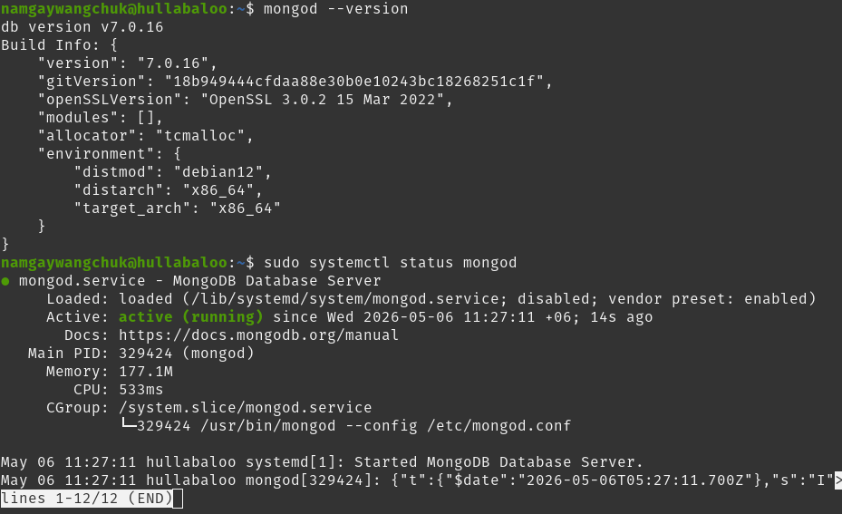

I then confirmed the database was initially "unsecured" by connecting without a password.
*   **Command:**
    ```bash
    mongosh --host 127.0.0.1 --port 27017
    ```
    > **Showing successful connection to the 'test>' prompt without auth**

    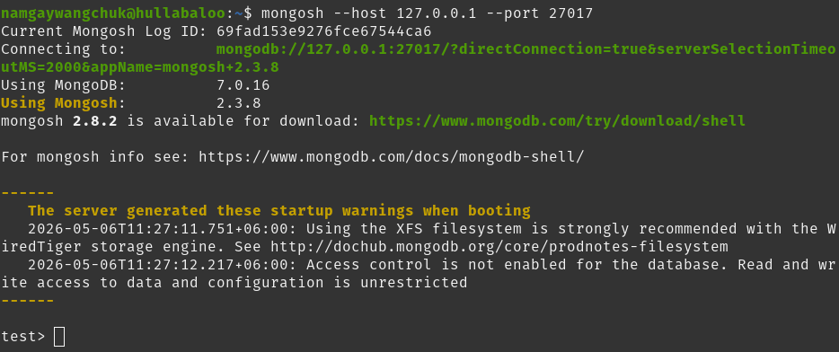

---

### 2. Administrative User & Auth Enforcement
I created a root administrator to manage the system once access control was enabled.

*   **Command (within mongosh):**
    ```javascript
    use admin;

    db.createUser({
    user: "rootAdmin",
    pwd: "rootStrongPwd",
    roles: [
        { role: "userAdminAnyDatabase", db: "admin" },
        { role: "dbAdminAnyDatabase", db: "admin" },
        { role: "readWriteAnyDatabase", db: "admin" }
    ]
    });
    ```
    > **Showing the 'db.createUser' success output {ok: 1}**

    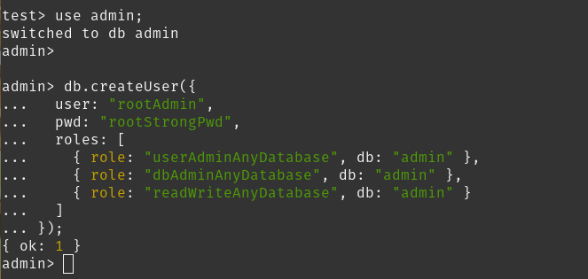

I then updated the configuration file to enforce this security.
*   **Command:** `sudo nano /etc/mongod.conf`
*   **Configuration Change:**
    ```yaml
    security:
      authorization: "enabled"
    ```
    > **Showing the 'security' section in the config file**

    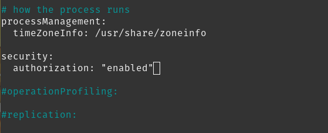

I restarted the service to apply changes: `sudo systemctl restart mongod`.
> **Showing the service restart command**

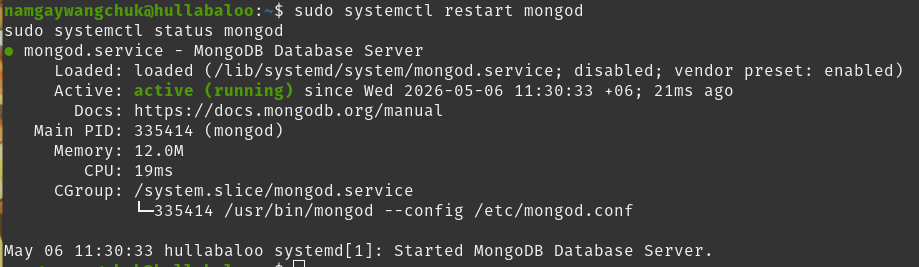

---

### 3. Verification of Access Control
I verified that the system now correctly identifies users and blocks unauthorized guests.

*   **Authenticated Login:**
    ```bash
    mongosh --host 127.0.0.1 --port 27017 \
    -u rootAdmin -p rootStrongPwd \
    --authenticationDatabase admin
    ```

    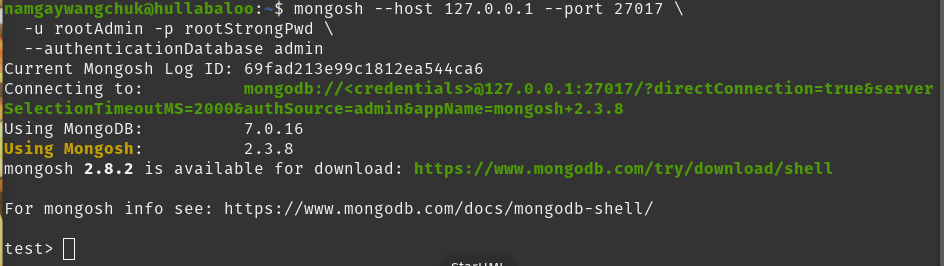

*   **Identity Check (within mongosh):** `db.runCommand({ connectionStatus: 1 });`
    > **Showing 'authenticatedUsers' list containing rootAdmin**

    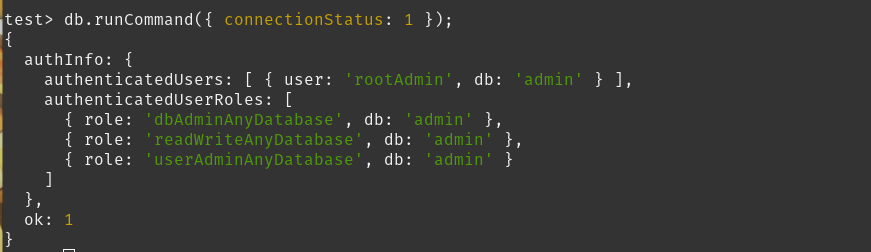

*   **Unauthenticated Rejection:** I attempted `show dbs` without logging in.
    > **Showing 'MongoServerError[Unauthorized]: Command listDatabases requires authentication'**

    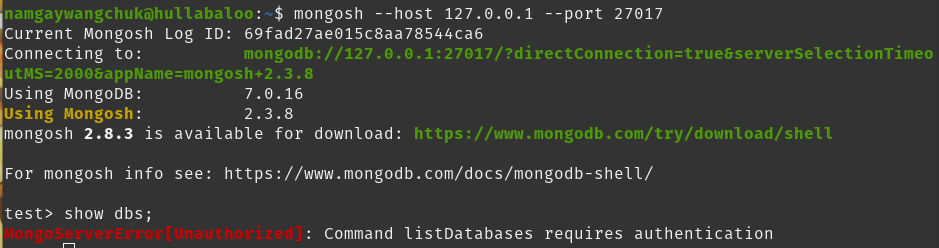

---

### 4. Role-Based Access Control (RBAC) Implementation
I implemented the principle of least privilege by creating a restricted application user.

*   **Commands (as Admin):**
    ```bash
    mongosh --host 127.0.0.1 --port 27017 \
    -u rootAdmin -p rootStrongPwd \
    --authenticationDatabase admin
    ```
    > **Showing 'createRole' and 'db.createUser' success**

    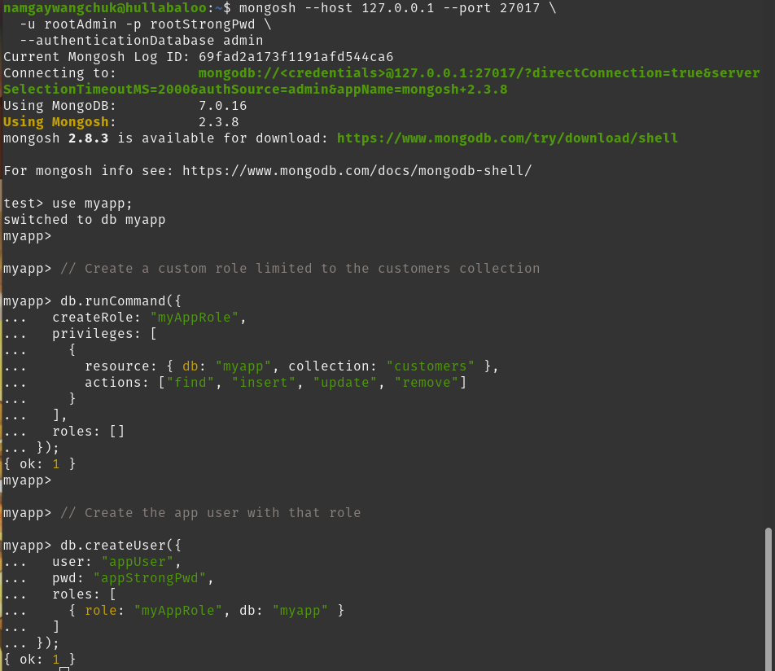

*   **Permission Testing:** I logged in as `appUser` and tested both allowed and denied actions.
    > **Showing 'db.customers.insertOne' & 'db.customers.find()' working successfully**

    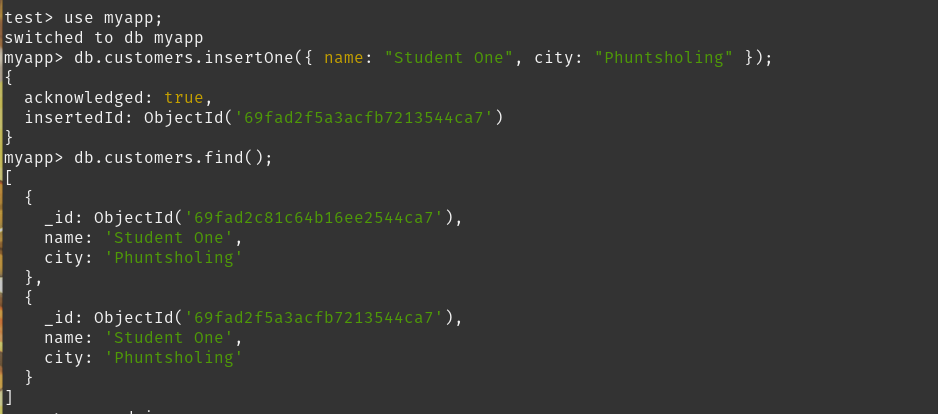

    > **Showing 'use admin; db.system.users.find()' failing with Unauthorized error**

    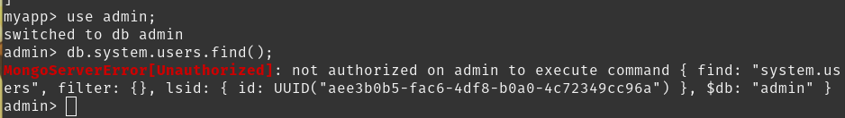

---

### 5. Transport Layer Security (TLS) Setup
I configured TLS to encrypt all traffic between the client and server.

*   **Certificate Generation:**
    ```bash
    sudo mkdir -p /etc/mongo/tls
    cd /etc/mongo/tls

    # CA key and certificate
    sudo openssl genrsa -out ca.key 4096
    sudo openssl req -x509 -new -nodes -key ca.key -sha256 -days 365 \
    -out ca.pem \
    -subj "/C=BT/ST=Chukha/L=Phuntsholing/O=DBS302/OU=Lab/CN=mongo-lab-ca"

    # Server key and CSR
    sudo openssl genrsa -out mongo.key 4096
    sudo openssl req -new -key mongo.key -out mongo.csr \
    -subj "/C=BT/ST=Chukha/L=Phuntsholing/O=DBS302/OU=Lab/CN=localhost"

    # Sign the server cert
    sudo openssl x509 -req -in mongo.csr -CA ca.pem -CAkey ca.key \
    -CAcreateserial -out mongo.crt -days 365 -sha256

    # Combine key + cert into single PEM (required by MongoDB)
    sudo bash -c 'cat mongo.key mongo.crt > mongo.pem'
    ```
    > **Showing the 'ls -la' of /etc/mongo/tls/ with all generated .pem files**

    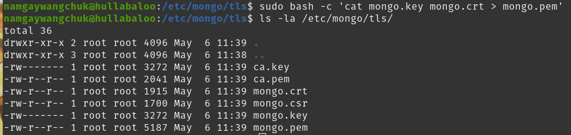

*   **Configuring mongod.conf by running `sudo nano /etc/mongod.conf`**
    ```yaml
    net:
    port: 27017
    bindIp: 127.0.0.1
    tls:
        mode: requireTLS
        certificateKeyFile: /etc/mongo/tls/mongo.pem
        CAFile: /etc/mongo/tls/ca.pem
        allowConnectionsWithoutCertificates: true

    security:
    authorization: "enabled"
    ```
    > **Showing the 'net: tls' configuration section**

    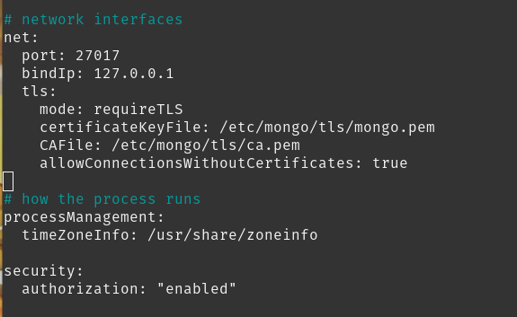

---

### 6. Technical Challenge: SAN Certificate Resolution
During testing, I encountered a connection error because the certificate was only valid for "localhost" but I was connecting via IP `127.0.0.1`.

*   **The Error:** `MongoServerSelectionError: Hostname/IP does not match certificate's altnames`.
    > **Showing the IP mismatch error message**

    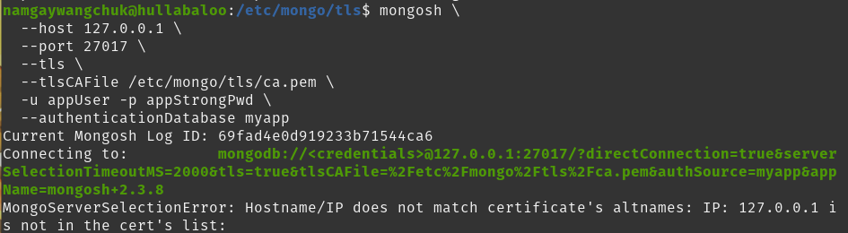

*   **The Fix:** I created a `san.cnf` file to include Subject Alternative Names.
    ```bash
    sudo nano san.cnf
    
    [req]
    default_bits = 4096
    prompt = no
    distinguished_name = dn
    req_extensions = req_ext

    [dn]
    C=BT
    ST=Chukha
    L=Phuntsholing
    O=DBS302
    OU=Lab
    CN=localhost

    [req_ext]
    subjectAltName = @alt_names

    [alt_names]
    DNS.1 = localhost
    IP.1 = 127.0.0.1
    ```
    > **Showing the 'san.cnf' file content**

    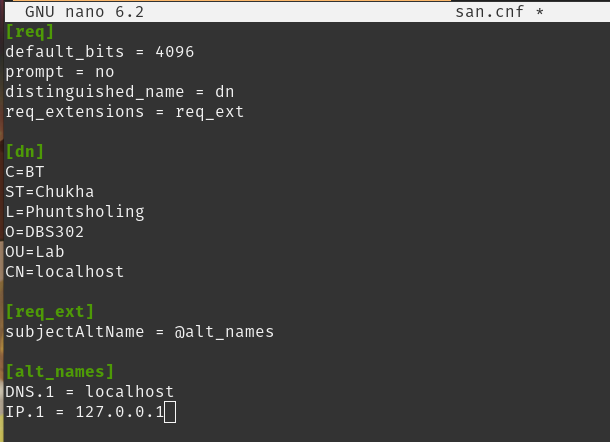

I then regenerated the server certificate using this config and restarted MongoDB.
> **Showing the regeneration commands and successful mongod restart**

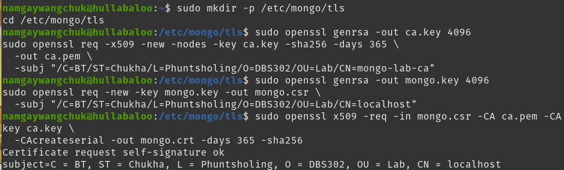

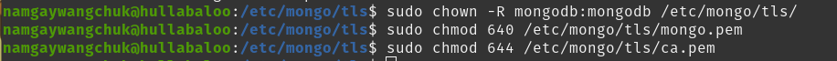

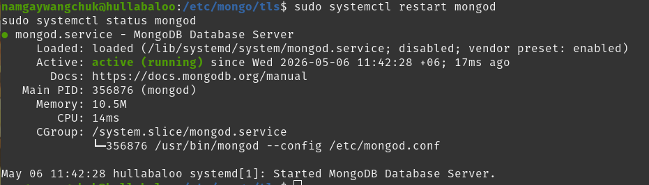

---

### 7. Final Verification & Node.js Integration
With SAN fixed, all security layers were functional.

*   **TLS CLI Connection:**
    ```bash
    mongosh \
    --host 127.0.0.1 \
    --port 27017 \
    --tls \
    --tlsCAFile /etc/mongo/tls/ca.pem \
    -u appUser -p appStrongPwd \
    --authenticationDatabase myapp
    ```
    > **Showing successful TLS connection and 'db.customers.find()'**

    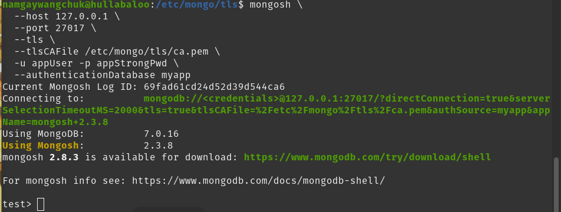

    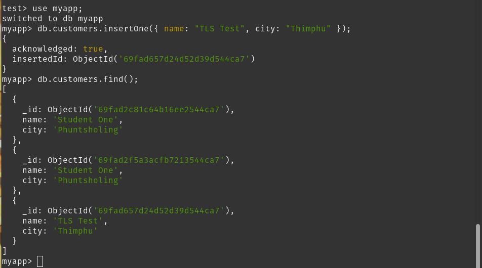

*   **Rejection of Plaintext:** I confirmed that connecting without `--tls` is now impossible.

    ```bash
    mongosh --host 127.0.0.1 --port 27017 \
    -u appUser -p appStrongPwd \
    --authenticationDatabase myapp
    ```
    > **Showing 'connection closed' when attempting non-TLS access**

    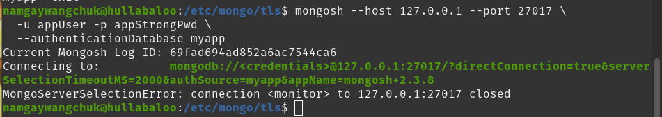

*   **Node.js Secure Demo:** I wrote and ran a Node.js script using the `tlsCAFile` option to prove programmatic security.
    > **Showing the 'mongo_secure_demo.js' code**

    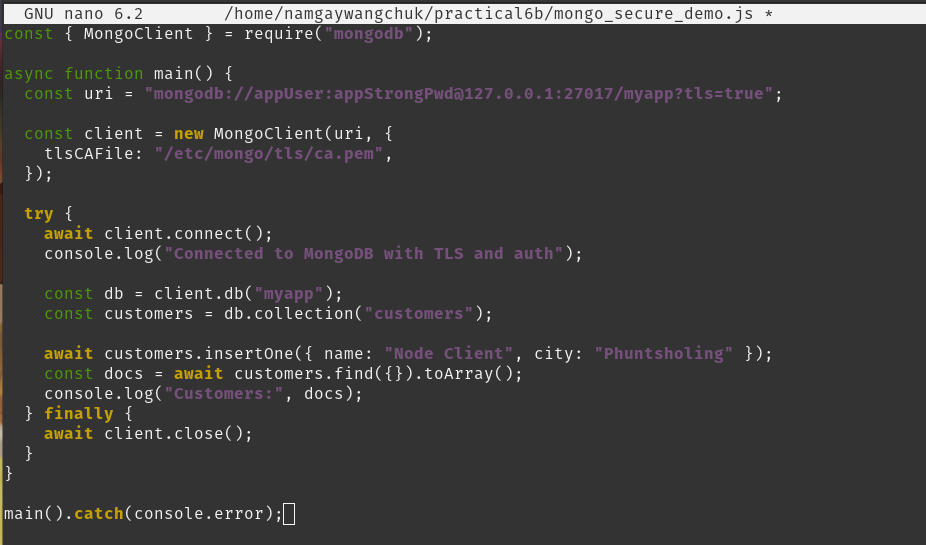

    > **Showing the script output: 'Connected to MongoDB with TLS and auth'**

    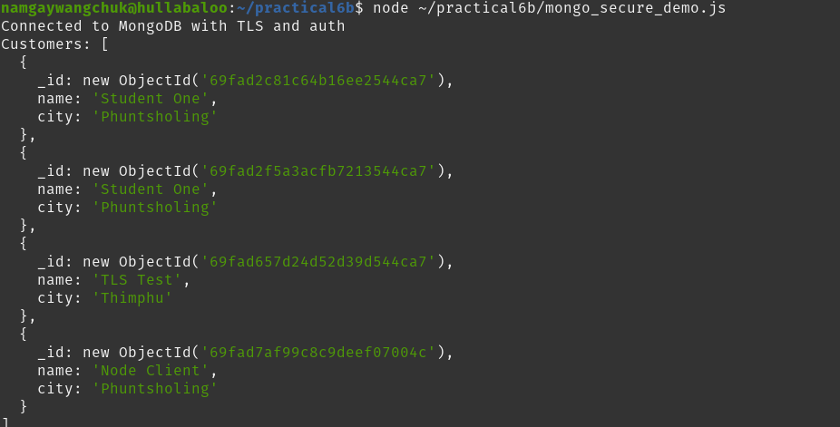

---

### Conclusion
I have successfully secured the MongoDB instance. By enforcing **Authentication** (identity), **RBAC** (minimum privilege), and **TLS** (encryption), the database is now protected against both external eavesdropping and internal unauthorized access.