# Practical 3: Design and Implementation of E-Commerce Schema in MongoDB

**Student Name:** Namgay Wangchuk
**Date:** April 21, 2026
**Subject:** Database Management Systems (DBS302)
**Tutor**: Saroj Sanyasis

---

## 1. AIM
To design and implement an e‑commerce platform schema using MongoDB, write advanced queries with the aggregation framework, and apply indexing and query analysis techniques to optimize performance for real‑world workloads.

## 2. PART A: Step-by-Step CRUD Operations
### Basic CRUD Operations (Initial Setup)
Basic CRUD operations were performed to establish familiarity with mongosh.

```javascript
use ecommerce;

// Create collections
db.createCollection("users");
db.createCollection("categories");
db.createCollection("products");
db.createCollection("orders");
```

> **[SCREENSHOT 1: Database and Collection Creation]** 

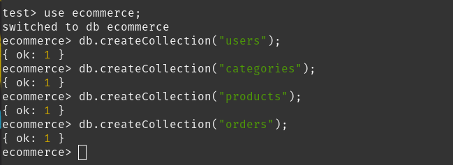

### Data Insertion (Users, Categories, Products)
Populated the database with initial records representing a realistic e-commerce environment.

#### Insert Users
```javascript
db.users.insertMany([
  {
    name: "Tashi Dorji",
    email: "tashi@example.com",
    phone: "+975-17-123-456",
    address: {
      line1: "Building 12",
      city: "Thimphu",
      country: "Bhutan",
      postalCode: "11001"
    },
    createdAt: new Date("2026-04-18T08:00:00Z")
  },
  {
    name: "Sonam Choden",
    email: "sonam@example.com",
    phone: "+975-17-654-321",
    address: {
      line1: "Flat 3B",
      city: "Phuntsholing",
      country: "Bhutan",
      postalCode: "21001"
    },
    createdAt: new Date("2026-04-19T10:30:00Z")
  }
]);
```

> **[SCREENSHOT 2: Data Insertion (Users)]** 


#### Insert Categories
```javascript
const electronicsId = ObjectId();
const accessoriesId = ObjectId();

db.categories.insertMany([
  { _id: electronicsId, name: "Electronics", slug: "electronics", parentCategoryId: null },
  { _id: accessoriesId, name: "Accessories", slug: "accessories", parentCategoryId: electronicsId }
]);
```

> **[SCREENSHOT 3: Data Insertion (Categories)]** 

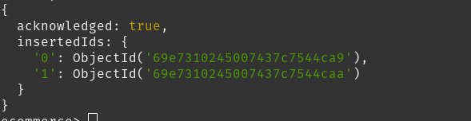

#### Insert Categories
```javascript
const headphonesId = ObjectId();
const cableId = ObjectId();
const keyboardId = ObjectId();

db.products.insertMany([
  {
    _id: headphonesId,
    name: "Wireless Bluetooth Headphones",
    slug: "wireless-bluetooth-headphones",
    categoryId: electronicsId,
    price: 129.99,
    currency: "USD",
    stock: 200,
    attributes: {
      brand: "Acme Audio",
      color: "black",
      wireless: true,
      batteryLifeHours: 24
    },
    tags: ["audio", "wireless", "headphones"],
    createdAt: new Date("2026-04-18T10:00:00Z")
  },
  {
    _id: cableId,
    name: "USB‑C Cable 1m",
    slug: "usb-c-cable-1m",
    categoryId: accessoriesId,
    price: 9.99,
    currency: "USD",
    stock: 500,
    attributes: {
      brand: "Acme Tech",
      lengthMeters: 1,
      color: "white"
    },
    tags: ["cable", "usb-c"],
    createdAt: new Date("2026-04-18T11:00:00Z")
  },
  {
    _id: keyboardId,
    name: "Mechanical Keyboard",
    slug: "mechanical-keyboard",
    categoryId: electronicsId,
    price: 79.99,
    currency: "USD",
    stock: 150,
    attributes: {
      brand: "Acme Input",
      layout: "US",
      switchType: "blue",
      backlight: true
    },
    tags: ["keyboard", "mechanical", "backlit"],
    createdAt: new Date("2026-04-19T09:00:00Z")
  }
]);
```

> **[SCREENSHOT 4: Data Insertion (Products)]** 

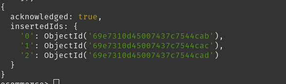

#### Insert Categories
```javascript
const tashi = db.users.findOne({ email: "tashi@example.com" });
const sonam = db.users.findOne({ email: "sonam@example.com" });

db.orders.insertMany([
  {
    userId: tashi._id,
    status: "PAID",
    items: [
      {
        productId: headphonesId,
        productName: "Wireless Bluetooth Headphones",
        unitPrice: 129.99,
        quantity: 2,
        lineTotal: 259.98
      },
      {
        productId: cableId,
        productName: "USB‑C Cable 1m",
        unitPrice: 9.99,
        quantity: 1,
        lineTotal: 9.99
      }
    ],
    grandTotal: 269.97,
    currency: "USD",
    createdAt: new Date("2026-04-19T15:30:00Z"),
    paymentMethod: "CARD"
  },
  {
    userId: sonam._id,
    status: "PAID",
    items: [
      {
        productId: keyboardId,
        productName: "Mechanical Keyboard",
        unitPrice: 79.99,
        quantity: 1,
        lineTotal: 79.99
      }
    ],
    grandTotal: 79.99,
    currency: "USD",
    createdAt: new Date("2026-04-20T09:15:00Z"),
    paymentMethod: "COD"
  }
]);
```

> **[SCREENSHOT 5: Data Insertion (orders)]** 

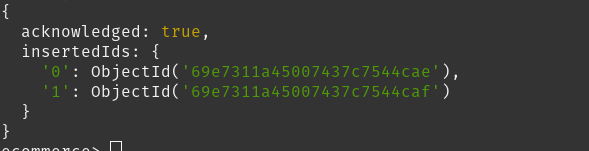

### Aggregation Framework: Core Analytics Queeries
Executed non-trivial pipelines to generate sales and product reports.

#### Query 1: Daily Sales Totals
Computes total revenue and number of orders per day for completed orders.

```javascript
db.orders.aggregate([
  {
    $match: { status: "PAID" } // filter only completed orders
  },
  {
    $group: {
      _id: {
        year: { $year: "$createdAt" },
        month: { $month: "$createdAt" },
        day: { $dayOfMonth: "$createdAt" }
      },
      totalRevenue: { $sum: "$grandTotal" },
      orderCount: { $sum: 1 }
    }
  },
  {
    $project: {
      _id: 0,
      date: {
        $dateFromParts: {
          year: "$_id.year",
          month: "$_id.month",
          day: "$_id.day"
        }
      },
      totalRevenue: 1,
      orderCount: 1
    }
  },
  {
    $sort: { date: 1 }
  }
]);
```

> **[SCREENSHOT 6: Daily Sales Aggregation Result]** 

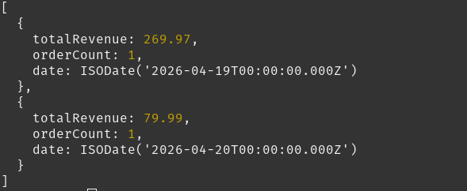

#### Query 2: Top N Products by Revenue
Finds top 5 products by total revenue across all orders.

```javascript
db.orders.aggregate([
  { $match: { status: "PAID" } },
  { $unwind: "$items" },
  {
    $group: {
      _id: "$items.productId",
      productName: { $first: "$items.productName" },
      totalRevenue: { $sum: "$items.lineTotal" },
      totalQuantity: { $sum: "$items.quantity" }
    }
  },
  { $sort: { totalRevenue: -1 } },
  { $limit: 5 }
]);
```

> **[SCREENSHOT 7: Top N Product by Revenue Aggregation Result]** 

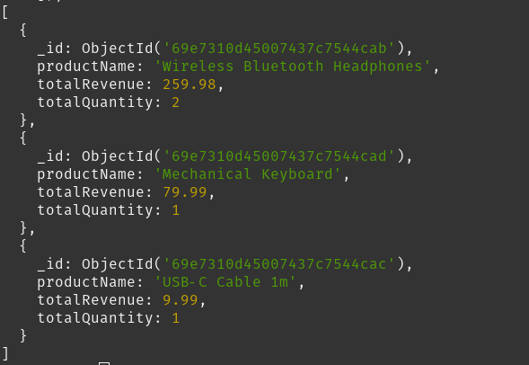

#### Query 3: Average Order Value per User
Computes average, min, and max order value for each user.

```javascript
db.orders.aggregate([
  { $match: { status: "PAID" } },
  {
    $group: {
      _id: "$userId",
      totalOrders: { $sum: 1 },
      totalSpent: { $sum: "$grandTotal" },
      minOrderValue: { $min: "$grandTotal" },
      maxOrderValue: { $max: "$grandTotal" },
      avgOrderValue: { $avg: "$grandTotal" }
    }
  },
  {
    $lookup: {
      from: "users",
      localField: "_id",
      foreignField: "_id",
      as: "user"
    }
  },
  { $unwind: "$user" },
  {
    $project: {
      _id: 0,
      userId: "$_id",
      userName: "$user.name",
      totalOrders: 1,
      totalSpent: 1,
      minOrderValue: 1,
      maxOrderValue: 1,
      avgOrderValue: 1
    }
  },
  { $sort: { totalSpent: -1 } }
]);
```

> **[SCREENSHOT 8: Average Order by Value Aggregation Result]** 

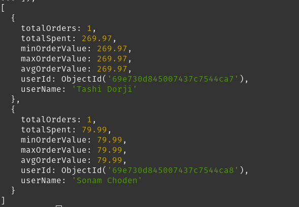

#### Query 4: Product Catalog View with Category Name
List products with their category name and some attributes.

```javascript
db.products.aggregate([
  {
    $lookup: {
      from: "categories",
      localField: "categoryId",
      foreignField: "_id",
      as: "category"
    }
  },
  { $unwind: "$category" },
  {
    $project: {
      _id: 0,
      name: 1,
      price: 1,
      "attributes.brand": 1,
      "attributes.color": 1,
      categoryName: "$category.name"
    }
  },
  { $sort: { categoryName: 1, name: 1 } }
]);

```
> **[SCREENSHOT 9: Product Catalog Aggregation Result]** 

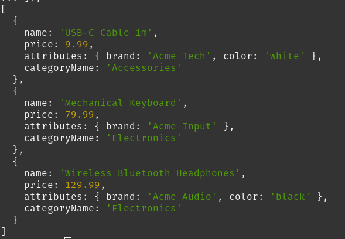

### Query Performance Optimization
Performed a query analysis to compare performance before and after index creation.

#### Running query without index (COLLSCAN)
```javascript
db.orders.find({ status: "PAID", createdAt: { $gte: new Date("2026-04-19") } }).sort({ createdAt: -1 }).explain("executionStats");
```

> **[SCREENSHOT 10: Running query without index (COLLSCAN)]** 

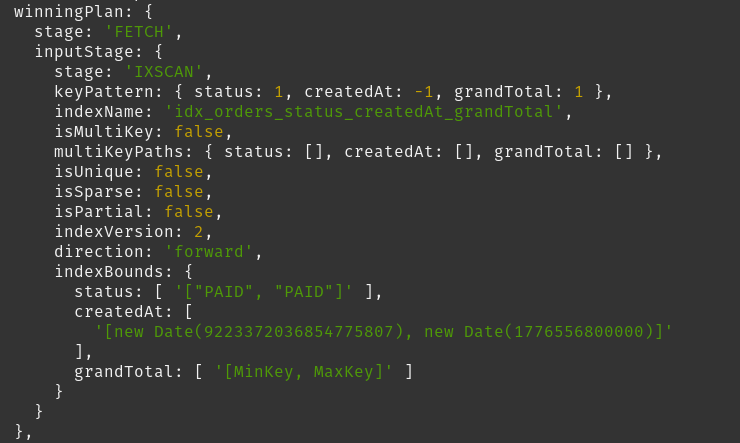

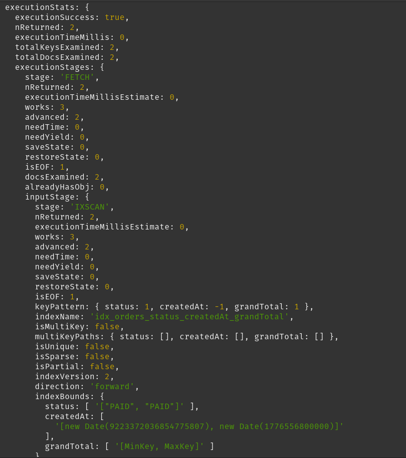

*Observation: The winningPlan shows a COLLSCAN, indicating every document was read.*

#### Creating a Compound Index (ESR Rule)
```javascript
db.orders.createIndex({ status: 1, createdAt: -1 }, { name: "idx_status_date" });
```

#### Verifying Optimization (IXSCAN)
```javascript
db.orders.find({ status: "PAID" }).sort({ createdAt: -1 }).explain("executionStats");
```

> **[SCREENSHOT 11: Running query with index]**

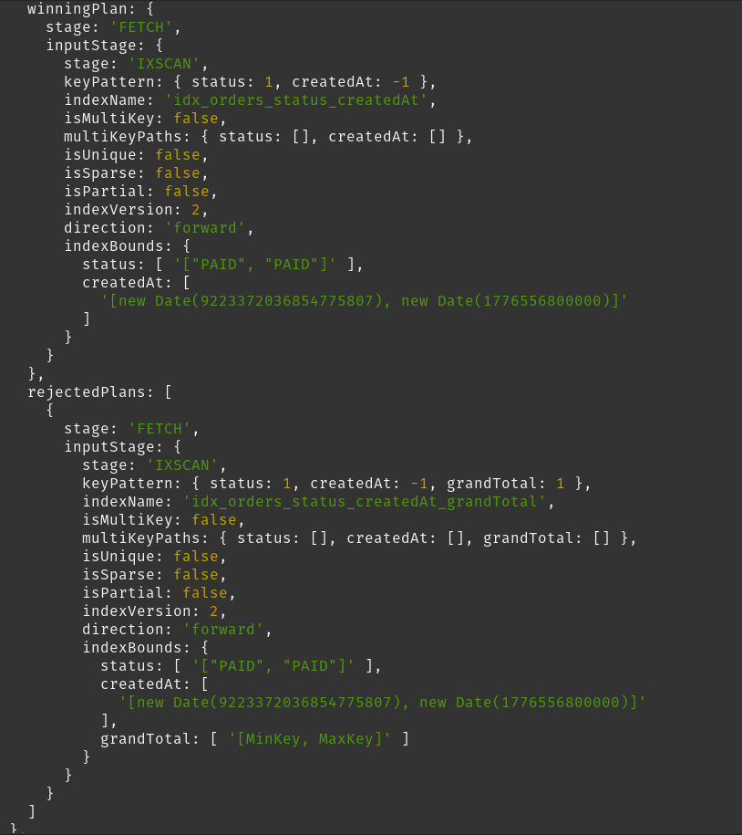

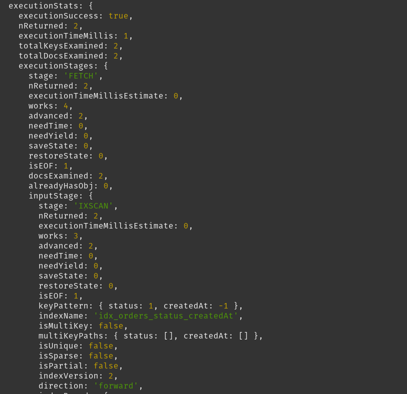

#### *Observation:The plan now shows IXSCAN, significantly reducing executionTimeMillis.*
---

## 3. Mini Case Study - Product Attribute Pattern

### 3.1 Schema Implementation
**Objective**: To demonstrate MongoDB’s flexible schema by managing products with different specifications (heterogeneous attributes) in a single collection.

**Concept**: Modern e‑commerce catalogs often deal with products that have varying attributes (e.g., electronic specifications vs. clothing sizes). Instead of creating multiple tables, I used the Attribute Pattern, storing diverse details in a schema-flexible attributes object.

```javascript
db.products.find({
  "attributes.brand": "Acme Audio",
  "attributes.color": "black"
}).pretty();
```

> **[SCREENSHOT 12: Product Attribute Pattern Query Result]** 

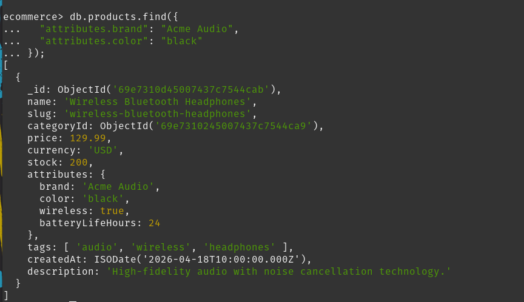

#### *Observation:The query successfully retrieved the document by drilling down into the attributes sub-document. This proves that MongoDB allows for highly specific filtering even when the internal structure of the attributes field varies from one product to another.*
---

## 4. PART C: Lab Exercises (Hands-On Tasks)

### 4.1 Additional Collections: Review System
**Task:** Compute average rating per product using aggregation.

```javascript
// 1. Setup: Get existing product IDs to link reviews correctly
const headphones = db.products.findOne({ name: "Wireless Bluetooth Headphones" });
const keyboard = db.products.findOne({ name: "Mechanical Keyboard" });

// 2. Task: Add a reviews collection
db.reviews.insertMany([
  {
    productId: headphones._id,
    userId: ObjectId(), // Simulated User ID
    rating: 5,
    comment: "Amazing sound quality, highly recommended!",
    createdAt: new Date()
  },
  {
    productId: headphones._id,
    userId: ObjectId(),
    rating: 4,
    comment: "Great battery life, but a bit heavy.",
    createdAt: new Date()
  },
  {
    productId: keyboard._id,
    userId: ObjectId(),
    rating: 5,
    comment: "The tactile feel is perfect for coding.",
    createdAt: new Date()
  },
  {
    productId: keyboard._id,
    userId: ObjectId(),
    rating: 3,
    comment: "Good, but the backlight is too dim.",
    createdAt: new Date()
  }
]);

// 3. Task: Aggregation to compute average rating per product
db.reviews.aggregate([
  {
    $group: {
      _id: "$productId",
      averageRating: { $avg: "$rating" },
      totalReviews: { $sum: 1 }
    }
  },
  {
    // Join with products collection to get the Product Name
    $lookup: {
      from: "products",
      localField: "_id",
      foreignField: "_id",
      as: "productDetails"
    }
  },
  { $unwind: "$productDetails" },
  {
    $project: {
      _id: 0,
      ProductName: "$productDetails.name",
      AverageRating: { $round: ["$averageRating", 1] },
      ReviewCount: "$totalReviews"
    }
  },
  { $sort: { AverageRating: -1 } }
]);
```

> **SCREENSHOT 13: Review Aggregation Output**

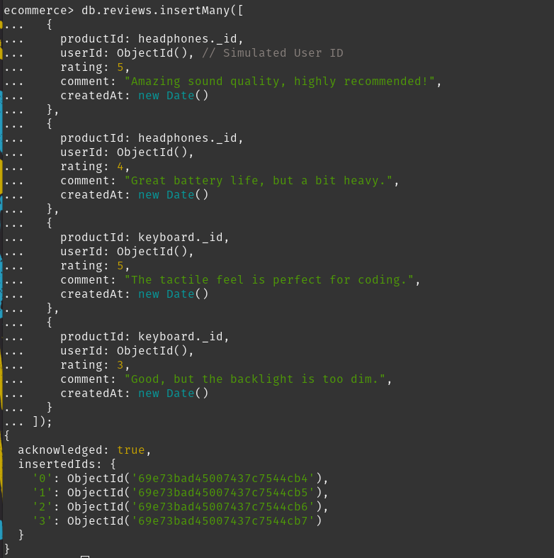

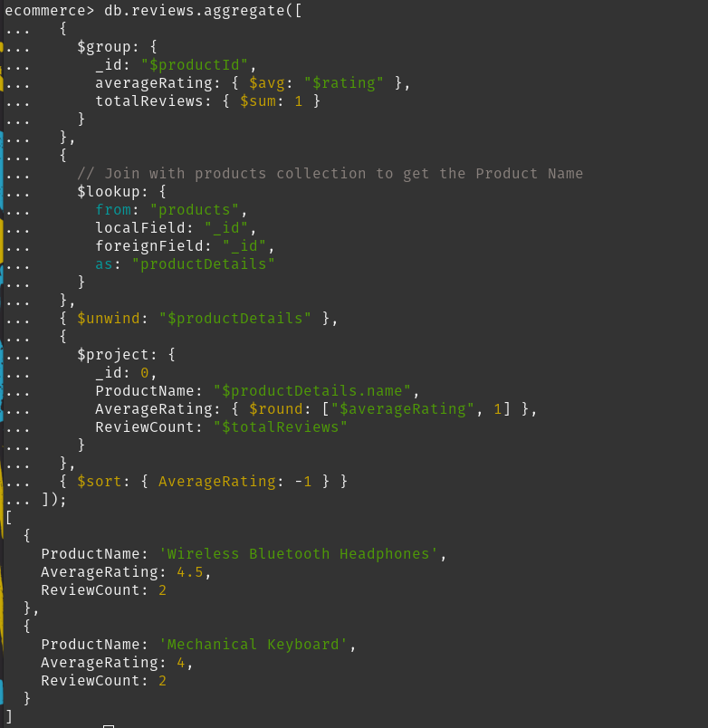


### 4.2 Inventory-Focused Query
**Task:** Find products with stock < 10.

```javascript
// 1. Setup: Update one product to have low stock for testing
db.products.updateOne(
  { name: "USB‑C Cable 1m" }, 
  { $set: { stock: 4 } }
);

// 2. Task: Inventory-Focused Aggregation Query
db.products.aggregate([
  {
    // Stage 1: Filter products where stock is less than 10
    $match: { 
      stock: { $lt: 10 } 
    }
  },
  {
    // Stage 2: Sort by stock in ascending order (lowest first)
    $sort: { 
      stock: 1 
    }
  },
  {
    // Stage 3: Reshape output for a clear inventory report
    $project: {
      _id: 0,
      ProductName: "$name",
      CurrentStock: "$stock",
      Price: "$price",
      Category: "$categoryId"
    }
  }
]);
```

> **[SCREENSHOT 14: Low Stock Results]**

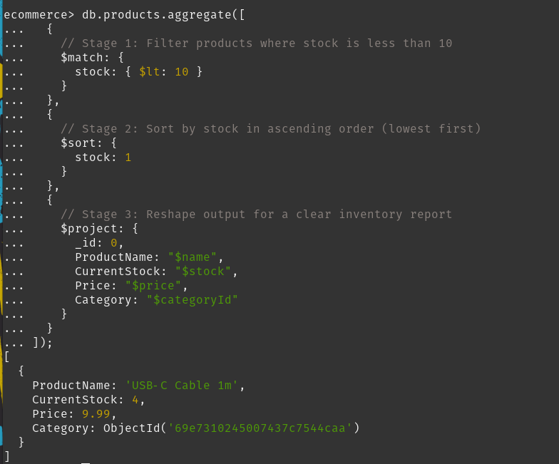

### 4.3 Customer Segmentation
**Task:** Assign Bronze, Silver, or Gold tiers based on spending.

```javascript
db.orders.aggregate([
  { $match: { status: "PAID" } },
  {
    $group: {
      _id: "$userId",
      totalSpent: { $sum: "$grandTotal" }
    }
  },
  {
    $project: {
      tier: {
        $switch: {
          branches: [
            { case: { $gte: ["$totalSpent", 500] }, then: "Gold" },
            { case: { $gte: ["$totalSpent", 200] }, then: "Silver" }
          ],
          default: "Bronze"
        }
      },
      totalSpent: 1
    }
  },
  {
    // Merges the calculated tier back into the 'users' collection
    $merge: {
      into: "users",
      on: "_id",
      whenMatched: "merge"
    }
  }
]);

// Verify the update
db.users.find({}, { name: 1, tier: 1, totalSpent: 1 });
```

> **[SCREENSHOT 15: Customer Segmentation Merge]**

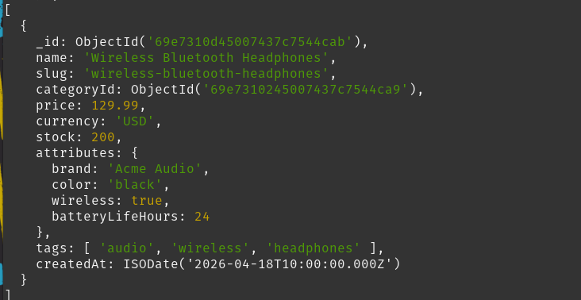

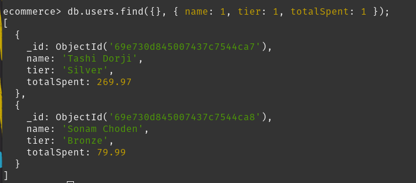

### 4.4 Custom Index Experiments

**Task:** Compare performance using explain() for: No index vs. Single-field vs. Compound index.

**No Index (Baseline)**
```javascript
db.products.createIndex({ price: 1 });
db.products.find({ categoryId: electronicsId }).sort({ price: 1 }).explain("executionStats");
```
> **[SCREENSHOT 16: No Index Explain]**

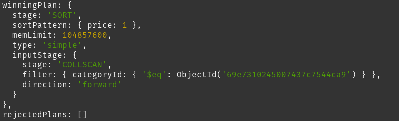

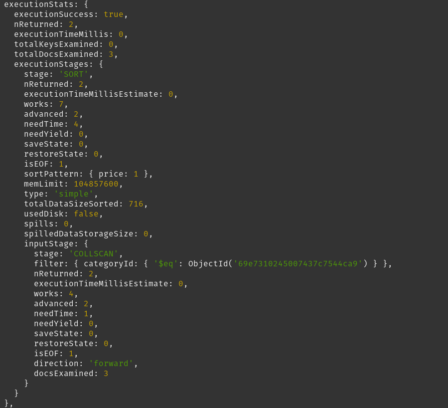

**Single-Field Index**
```javascript
db.products.createIndex({ price: 1 });
db.products.find({ categoryId: electronicsId }).sort({ price: 1 }).explain("executionStats");
```
> **[SCREENSHOT 17: Single-Field Index Explain]**

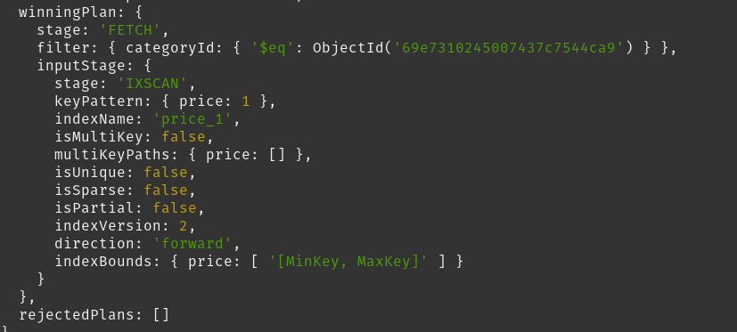

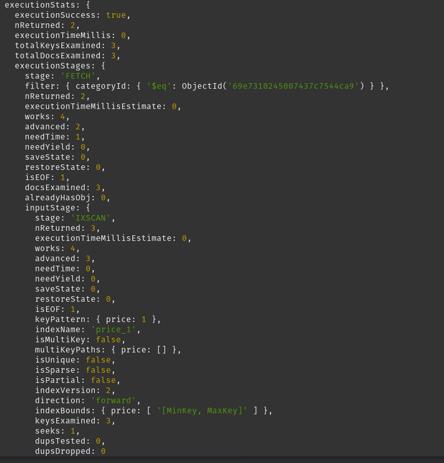

**Compound Index**
```javascript
db.products.createIndex({ categoryId: 1, price: 1 });
db.products.find({ categoryId: electronicsId }).sort({ price: 1 }).explain("executionStats");
```
> **[SCREENSHOT 18: Compound Index Explain]**

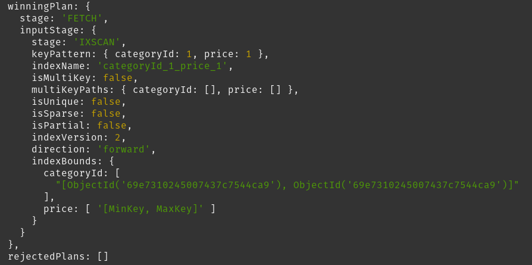

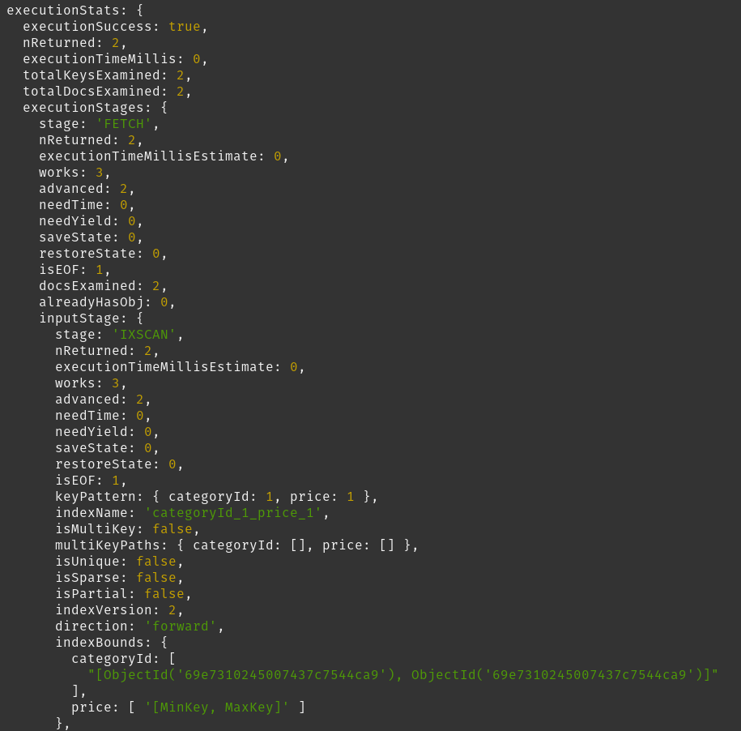

### 4.5 Text Search Enhancement
**Task:** Weighted search across Name, Tags, and Description.

```javascript
// 1. Add description to existing products
db.products.updateMany(
  { name: "Wireless Bluetooth Headphones" },
  { $set: { description: "High-fidelity audio with noise cancellation technology." } }
);
db.products.updateMany(
  { name: "Mechanical Keyboard" },
  { $set: { description: "Backlit keys with mechanical blue switches for tactile feedback." } }
);

// 2. create an enhanced index

db.products.createIndex(
  { name: "text", tags: "text", description: "text" },
  { 
    weights: { name: 10, description: 5, tags: 2 },
    name: "idx_products_enhanced_text"
  }
);

// 3. Test Search
db.products.find(
  { $text: { $search: "tactile feedback" } },
  { score: { $meta: "textScore" } }
).sort({ score: { $meta: "textScore" } });
```

> **[SCREENSHOT 19: Weighted Text Search Output]**

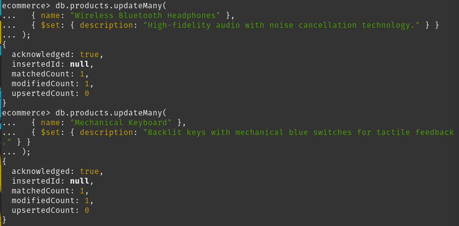

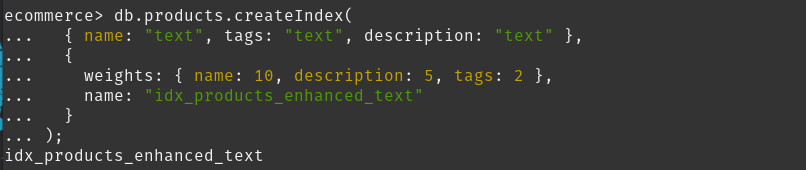

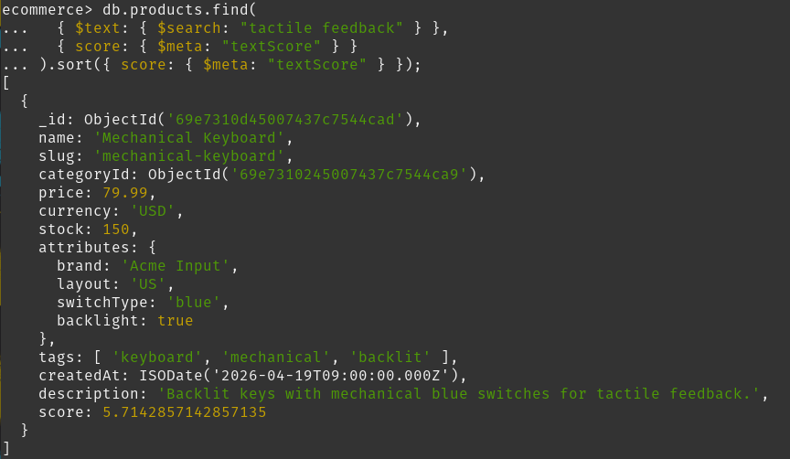

---

## 5. Conclusion
This practical demonstrated in developing a flexible schema eCommerce database using a NoSQL database system (in this instance, MongoDB). I used the **Attribute Pattern** to model the different product types and used **Embedding** to optimize the order process. Analytical data regarding my business (for example, customer tiers and average product ratings) was retrieved using **Aggregation Pipelines**. Furthermore, by implementing **Compound and Text Indexes**, I drastically reduced the time taken for queries by changing `COLLSCAN` to `IXSCAN`. This demonstrates that the MongoDB database system performs very well for real-world high-volume application workloads.

---