# DBS302 – NoSQL Database Management

## Practical 1: Setting Up Redis, MongoDB, and Cassandra — Implementing a Social Media Data Model and Contrasting Query Patterns


**Name:** Namgay Wangchuk
**Module:** DBS302 – NoSQL Database Management

---

## 1. Aim

The aim of this practical is to set up three distinct NoSQL databases; Redis, MongoDB, and Cassandra; on a local development environment using Docker, implement a simple social media data model in each database, and contrast their respective query patterns and performance characteristics.

---

## 2. Objectives

By the end of this practical, I was able to:

- Install and verify working installations of Redis, MongoDB, and Cassandra using Docker containers.
- Understand how each database represents data differently: as key-value pairs (Redis), as BSON documents (MongoDB), and as column-family tables (Cassandra).
- Design and implement a social media data model (users, posts, and followers) suited to each database's paradigm.
- Perform basic CRUD operations in each database using their respective interfaces: `redis-cli`, `mongosh`, and `cqlsh`.
- Contrast the query syntax, flexibility, and performance characteristics of each database.

---

## 3. Background Theory

### 3.1 Why Three Different NoSQL Databases?

NoSQL databases are not a single technology but a family of systems designed to solve different data management problems. The three databases covered in this practical each represent a distinct NoSQL category:

| Database  | NoSQL Category      | Primary Strength                          | CAP Positioning      |
|-----------|---------------------|-------------------------------------------|----------------------|
| Redis     | Key-Value Store     | In-memory speed, caching, session storage | CP (configurable)    |
| MongoDB   | Document Store      | Flexible schema, rich queries             | CP (configurable)    |
| Cassandra | Column-Family Store | Write-heavy workloads, linear scalability | AP (tunable)         |

### 3.2 The Social Media Data Model

A social media platform is an ideal use case for studying NoSQL databases because it involves:

- **User profiles** — structured entities with fixed and flexible attributes.
- **Posts / Tweets / Updates** — high-volume, write-heavy data.
- **Follower relationships** — graph-like relationships.
- **Feeds and timelines** — read-heavy, time-ordered access patterns.

The same conceptual model was implemented in all three databases, making it straightforward to contrast how each system approaches identical requirements.

### 3.3 CAP Theorem Recap

The CAP theorem states that a distributed system can guarantee only two of the three following properties simultaneously:

- **Consistency (C):** Every read receives the most recent write.
- **Availability (A):** Every request receives a response (not necessarily the latest data).
- **Partition Tolerance (P):** The system continues to operate despite network partitions.

---

## 4. Environment and Tools

| Tool             | Version       | Purpose                          |
|------------------|---------------|----------------------------------|
| Docker           | Latest        | Container-based database setup   |
| Redis            | 7.2           | Key-value store                  |
| MongoDB          | 7.0           | Document store                   |
| Apache Cassandra | 4.1           | Column-family store              |
| redis-cli        | Bundled       | Redis command-line interface     |
| mongosh          | 2.x           | MongoDB shell                    |
| cqlsh            | Bundled       | Cassandra Query Language shell   |
| Python           | 3.10+         | Performance benchmarking         |

---

## 5. Setup and Installation

### 5.1 Creating the Project Directory

I started by creating a dedicated project directory for this practical:

```bash
mkdir nosql-practical-1
cd nosql-practical-1
```

### 5.2 Creating the docker-compose.yml File

I created a `docker-compose.yml` file to define all three database services:

```bash
nano docker-compose.yml
```

Contents of the file:

```yaml
version: "3.9"

services:
  redis:
    image: redis:7.2
    container_name: redis_social
    ports:
      - "6379:6379"
    command: redis-server --save 60 1 --loglevel warning
    volumes:
      - redis_data:/data

  mongodb:
    image: mongo:7.0
    container_name: mongo_social
    ports:
      - "27017:27017"
    environment:
      MONGO_INITDB_ROOT_USERNAME: admin
      MONGO_INITDB_ROOT_PASSWORD: password123
    volumes:
      - mongo_data:/data/db

  cassandra:
    image: cassandra:4.1
    container_name: cassandra_social
    ports:
      - "9042:9042"
    environment:
      - CASSANDRA_CLUSTER_NAME=SocialCluster
      - CASSANDRA_DC=datacenter1
      - HEAP_NEWSIZE=128M
      - MAX_HEAP_SIZE=512M
    volumes:
      - cassandra_data:/var/lib/cassandra

volumes:
  redis_data:
  mongo_data:
  cassandra_data:
```

### 5.3 Starting the Containers

```bash
docker compose up -d
```

I then verified all containers were running:

```bash
docker compose ps
```

> **Note:** Since native Redis from Practical 6 was already running on port 6379, I first stopped it before starting the Docker Redis container:
> ```bash
> sudo systemctl stop redis-server
> docker compose up -d redis
> ```

**Screenshot : docker compose ps showing all three containers running:**

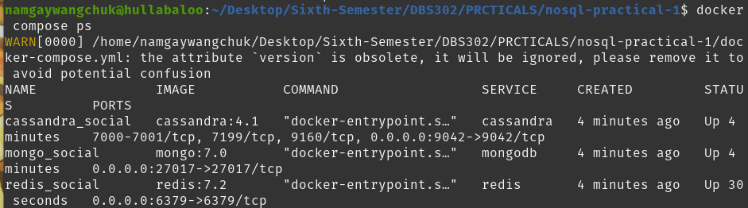

---

## 6. Part A — Redis: Key-Value Social Media Model

### 6.1 Connecting to Redis

I connected to the Redis container using redis-cli:

```bash
docker exec -it redis_social redis-cli
```

I verified the connection with:

```
127.0.0.1:6379> PING
PONG
```

**Screenshot : Redis PING returning PONG:**

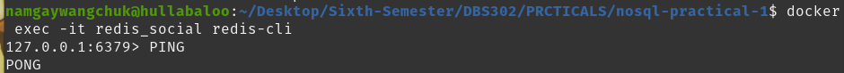

---

### 6.2 Step 1: Creating User Profiles (Hashes)

In Redis, each user is stored as a Hash under a namespaced key `user:{user_id}`. I created three user profiles:

```redis
HSET user:1001 username "alice" name "Alice Johnson" bio "Software engineer and coffee lover." joined "2024-01-15" followers_count 0 following_count 0

HSET user:1002 username "bob" name "Bob Smith" bio "Tech enthusiast and open-source contributor." joined "2024-02-20" followers_count 0 following_count 0

HSET user:1003 username "carol" name "Carol Williams" bio "Designer and digital artist." joined "2024-03-10" followers_count 0 following_count 0
```

I retrieved Alice's full profile:

```redis
HGETALL user:1001
```

And retrieved a single field:

```redis
HGET user:1001 username
```

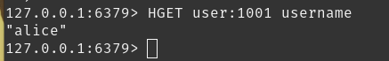

**Screenshot : HGETALL user:1001 output:**

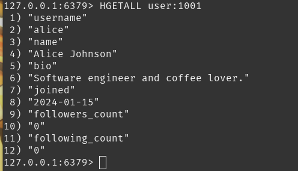


---

### 6.3 Step 2: Modelling Follower Relationships (Sets)

A Set is used to track followers and following lists for each user. I set up the following relationships:
- Alice (1001) follows Bob (1002) and Carol (1003)
- Bob (1002) follows Carol (1003)

```redis
SADD following:1001 1002 1003
SADD followers:1002 1001
SADD followers:1003 1001

SADD following:1002 1003
SADD followers:1003 1002
```

I retrieved everyone Alice follows:

```redis
SMEMBERS following:1001
```

I checked if Alice follows Bob:

```redis
SISMEMBER following:1001 1002
```

I found mutual follows between Alice and Bob:

```redis
SINTERSTORE mutual:1001:1002 following:1001 following:1002
SMEMBERS mutual:1001:1002
```

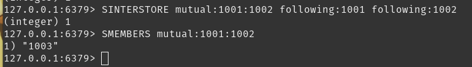

I then updated the follower counts in each user's Hash:

```redis
HINCRBY user:1001 following_count 2
HINCRBY user:1002 followers_count 1
HINCRBY user:1003 followers_count 2
```

**Screenshot : SMEMBERS and SISMEMBER output:**

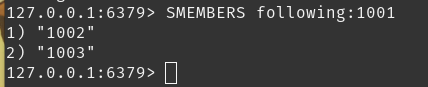

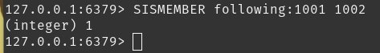


---

### 6.4 Step 3: Modelling Posts (Hashes + Lists)

Each post is stored as a Hash with a unique post ID. A List represents the user's timeline, with the most recent post at the front.

```redis
HSET post:p001 user_id 1001 content "Just set up my NoSQL development environment. Redis is incredibly fast!" timestamp "2025-05-01T10:00:00Z" likes 0

HSET post:p002 user_id 1001 content "MongoDB's document model makes data modeling so intuitive." timestamp "2025-05-01T11:30:00Z" likes 0

HSET post:p003 user_id 1002 content "Learning about CAP theorem today. Fascinating trade-offs in distributed systems." timestamp "2025-05-01T09:00:00Z" likes 0
```

I pushed post IDs to the user timelines:

```redis
LPUSH timeline:1001 p001 p002
LPUSH timeline:1002 p003
```

I retrieved Alice's 10 most recent posts:

```redis
LRANGE timeline:1001 0 9
```

**Screenshot : LRANGE timeline:1001 output:**

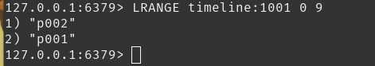

---

### 6.5 Step 4: Building a News Feed (Sorted Set)

A Sorted Set stores post IDs with Unix timestamps as scores, enabling chronological ordering. I built Carol's news feed (she follows Alice and Bob):

```redis
ZADD feed:1003 1746345600 p001
ZADD feed:1003 1746352200 p002
ZADD feed:1003 1746338400 p003
```

I retrieved Carol's feed, most recent first:

```redis
ZREVRANGE feed:1003 0 9 WITHSCORES
```

**Screenshot : ZREVRANGE feed output:**

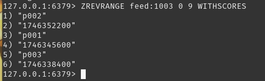

---

### 6.6 Step 5: Like Counter (Atomic Increment)

I demonstrated Redis's atomic counter using `INCR`:

```redis
INCR post:p001:likes
INCR post:p001:likes
INCR post:p001:likes
GET post:p001:likes
```

Expected output: `"3"`

**Screenshot : INCR and GET likes output:**

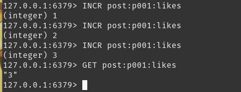

---

### 6.7 Redis Query Patterns Summary

| Operation              | Command Used                          | Time Complexity      |
|------------------------|---------------------------------------|----------------------|
| Retrieve user profile  | `HGETALL user:{id}`                   | O(N) fields          |
| Check follow status    | `SISMEMBER following:{id} {id}`       | O(1)                 |
| Get mutual follows     | `SINTER following:{id} following:{id}`| O(N*M)               |
| Get recent posts       | `LRANGE timeline:{id} 0 9`            | O(S+N)               |
| Get chronological feed | `ZREVRANGE feed:{id} 0 9`             | O(log(N)+M)          |
| Increment counter      | `INCR post:{id}:likes`                | O(1)                 |

### 6.8 Redis Observations

- Redis operates entirely in memory, making all operations sub-millisecond.
- There is no enforced schema; naming conventions must be maintained manually by the developer.
- Complex queries such as "find all posts by users that Alice follows, ordered by time" require multiple round trips or client-side logic.
- Redis does not natively support relationships; these are modelled through separate keys.

---

## 7. Part B — MongoDB: Document Social Media Model

### 7.1 Connecting to MongoDB

I connected to the MongoDB container using mongosh with admin credentials:

```bash
docker exec -it mongo_social mongosh -u admin -p password123 --authenticationDatabase admin
```

I switched to the social media database:

```javascript
use social_media_db
```

**Screenshot : mongosh connection and database switch:**

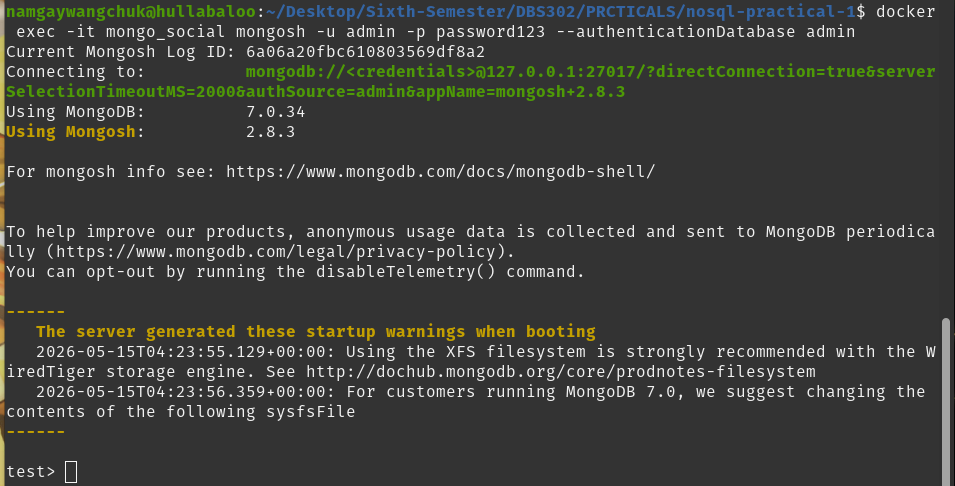

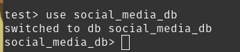

---

### 7.2 Step 1: Creating the Users Collection

I inserted three user documents into the `users` collection:

```javascript
db.users.insertMany([
  {
    _id: "user_1001",
    username: "alice",
    name: "Alice Johnson",
    bio: "Software engineer and coffee lover.",
    joined: new Date("2024-01-15"),
    followers_count: 2,
    following_count: 1,
    following: ["user_1002", "user_1003"]
  },
  {
    _id: "user_1002",
    username: "bob",
    name: "Bob Smith",
    bio: "Tech enthusiast and open-source contributor.",
    joined: new Date("2024-02-20"),
    followers_count: 1,
    following_count: 1,
    following: ["user_1003"]
  },
  {
    _id: "user_1003",
    username: "carol",
    name: "Carol Williams",
    bio: "Designer and digital artist.",
    joined: new Date("2024-03-10"),
    followers_count: 2,
    following_count: 0,
    following: []
  }
])
```

**Screenshot : insertMany output for users:**

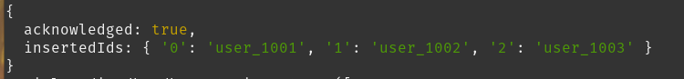

---

### 7.3 Step 2: Creating the Posts Collection

Each post document embeds likes and comments arrays directly inside the document, demonstrating MongoDB's embedded design pattern:

```javascript
db.posts.insertMany([
  {
    _id: "post_p001",
    user_id: "user_1001",
    username: "alice",
    content: "Just set up my NoSQL development environment. Redis is incredibly fast!",
    created_at: new Date("2025-05-01T10:00:00Z"),
    likes: [],
    comments: [],
    tags: ["redis", "nosql", "databases"]
  },
  {
    _id: "post_p002",
    user_id: "user_1001",
    username: "alice",
    content: "MongoDB's document model makes data modeling so intuitive.",
    created_at: new Date("2025-05-01T11:30:00Z"),
    likes: ["user_1002"],
    comments: [
      {
        user_id: "user_1002",
        username: "bob",
        text: "Absolutely agree! Especially for nested data.",
        created_at: new Date("2025-05-01T12:00:00Z")
      }
    ],
    tags: ["mongodb", "nosql", "datamodeling"]
  },
  {
    _id: "post_p003",
    user_id: "user_1002",
    username: "bob",
    content: "Learning about CAP theorem today. Fascinating trade-offs in distributed systems.",
    created_at: new Date("2025-05-01T09:00:00Z"),
    likes: ["user_1001", "user_1003"],
    comments: [],
    tags: ["cap", "distributed-systems", "nosql"]
  },
  {
    _id: "post_p004",
    user_id: "user_1003",
    username: "carol",
    content: "Designed a new UI mockup for a social feed. Sharing soon!",
    created_at: new Date("2025-05-01T14:00:00Z"),
    likes: [],
    comments: [],
    tags: ["design", "ui", "ux"]
  }
])
```

**Screenshot : insertMany output for posts:**

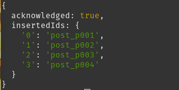

---

### 7.4 Step 3: Basic Read Queries

I ran several read queries to demonstrate MongoDB's query flexibility:

**All posts by Alice:**
```javascript
db.posts.find({ user_id: "user_1001" }).pretty()
```

**Screenshot : find posts by Alice output:**

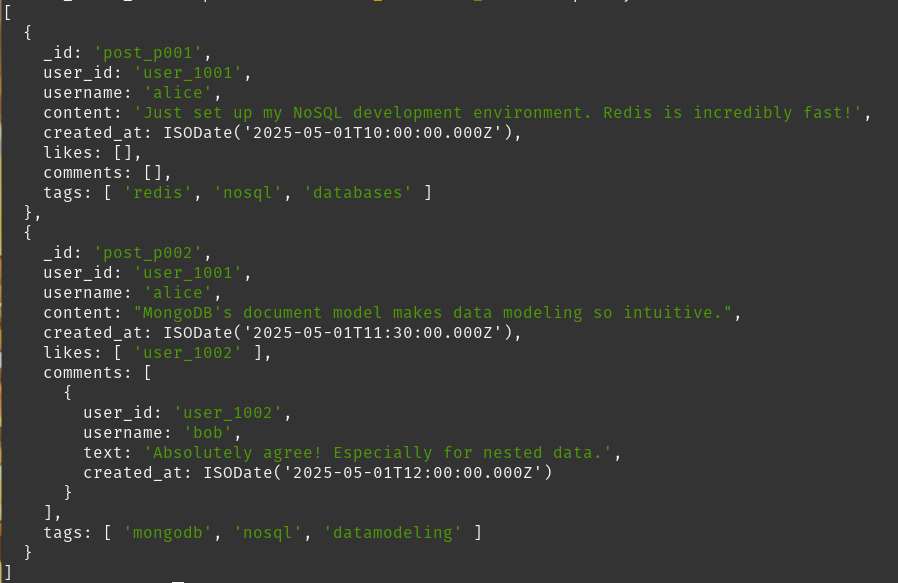

---

**Projection — content and date only:**
```javascript
db.posts.find(
  { user_id: "user_1001" },
  { content: 1, created_at: 1, _id: 0 }
)
```

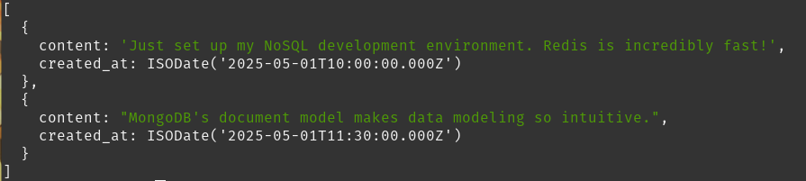

**Find posts tagged "nosql":**
```javascript
db.posts.find({ tags: "nosql" }).pretty()
```

**Find posts with at least one like:**
```javascript
db.posts.find({ "likes.0": { $exists: true } })
```

**Screenshot : find by tag output:**

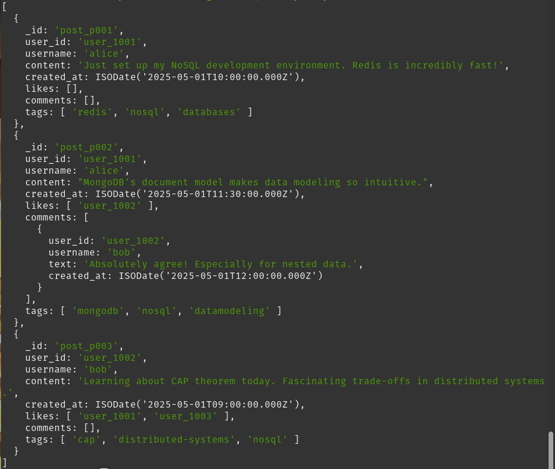

**Screenshot : find by likes output:**

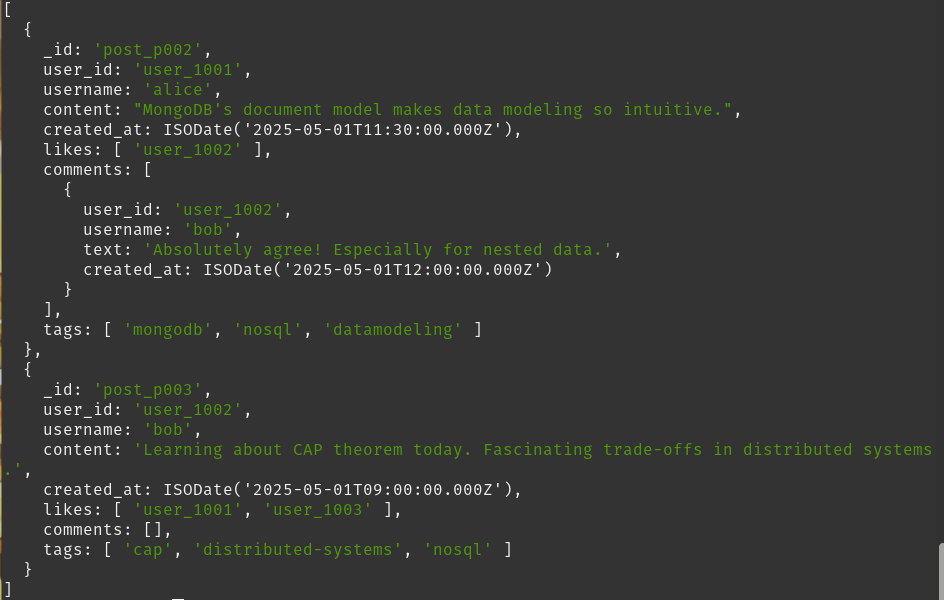

---

### 7.5 Step 4: Update Operations

**Adding a like to a post:**
```javascript
db.posts.updateOne(
  { _id: "post_p001" },
  {
    $push: { likes: "user_1003" },
    $inc: { likes_count: 1 }
  }
)
```

**Adding a comment to a post:**
```javascript
db.posts.updateOne(
  { _id: "post_p001" },
  {
    $push: {
      comments: {
        user_id: "user_1003",
        username: "carol",
        text: "Great setup! Which OS are you using?",
        created_at: new Date()
      }
    }
  }
)
```

**Screenshot : updateOne output:**

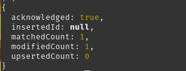

---

### 7.6 Step 5: Aggregation Pipeline — Building a News Feed

The aggregation pipeline is one of MongoDB's most powerful features. I built Alice's feed — showing posts from users she follows, sorted most recent first:

```javascript
db.posts.aggregate([
  { $match: { user_id: { $in: ["user_1002", "user_1003"] } } },
  { $sort: { created_at: -1 } },
  { $limit: 10 },
  {
    $project: {
      username: 1,
      content: 1,
      created_at: 1,
      likes_count: { $size: { $ifNull: ["$likes", []] } },
      comments_count: { $size: { $ifNull: ["$comments", []] } }
    }
  }
])
```

**Screenshot : aggregation pipeline output:**

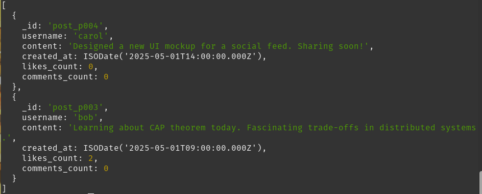

---

### 7.7 Step 6: Creating Indexes

Without indexes, MongoDB performs a full collection scan on every query. I created the following indexes:

```javascript
// Index on user_id for per-user post queries
db.posts.createIndex({ user_id: 1 })

// Compound index for feed queries
db.posts.createIndex({ user_id: 1, created_at: -1 })

// Text index for full-text search
db.posts.createIndex({ content: "text", tags: "text" })
```

I tested the text index:
```javascript
db.posts.find({ $text: { $search: "distributed systems" } })
```
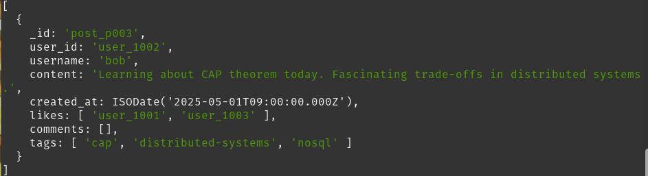

I verified all indexes:
```javascript
db.posts.getIndexes()
```

I checked the query execution plan:
```javascript
db.posts.find({ user_id: "user_1001" }).explain("executionStats")
```

**Screenshot : getIndexes output:**

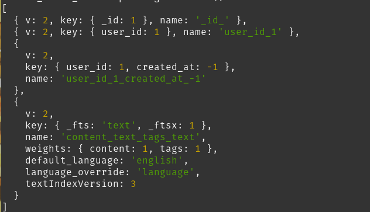

**Screenshot : explain output:**

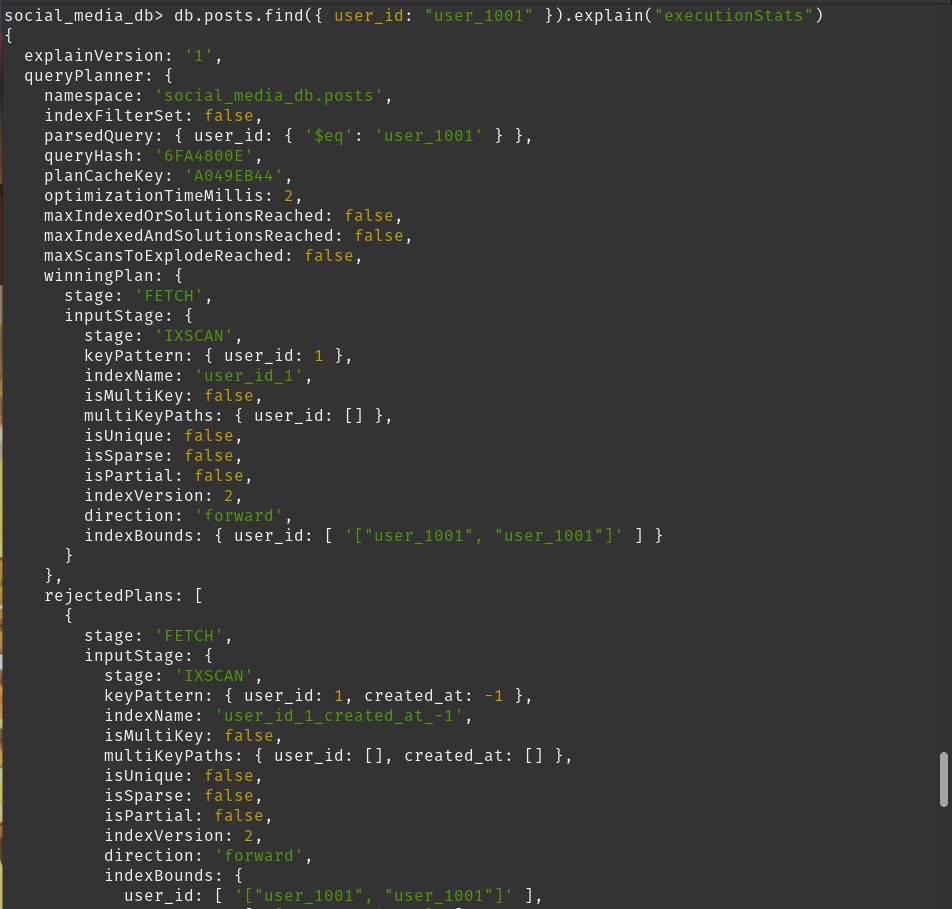

---

### 7.8 MongoDB Observations

- The document model naturally accommodates nested structures (comments within posts), eliminating the need for join tables.
- The aggregation framework enables complex server-side data transformations in a single query.
- Schema flexibility is powerful but requires discipline; without validation, data inconsistencies can accumulate.
- Indexes are critical — an unindexed query on a large collection results in a full collection scan (COLLSCAN).

---

## 8. Part C — Cassandra: Column-Family Social Media Model

### 8.1 Connecting to Cassandra

I waited approximately 60 seconds after container startup for Cassandra to fully initialize, then connected:

```bash
docker exec -it cassandra_social cqlsh
```

I verified the cluster:

```cql
DESCRIBE CLUSTER;
```

**Screenshot : cqlsh connection output:**

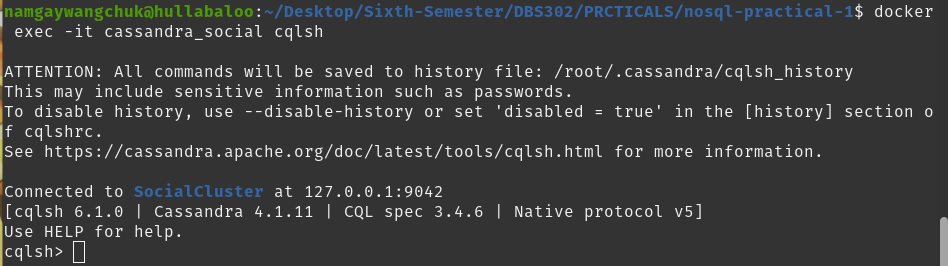

**Screenshot : DESCRIBE CLUSTER output:**

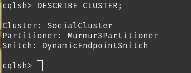

---

### 8.2 Step 1: Creating the Keyspace

```cql
CREATE KEYSPACE IF NOT EXISTS social_media
WITH replication = {
  'class': 'SimpleStrategy',
  'replication_factor': 1
};

USE social_media;
```

> **Note:** `SimpleStrategy` with `replication_factor: 1` is appropriate for a single-node development setup. In production, `NetworkTopologyStrategy` with a factor of 3 or more is standard.

---

### 8.3 Step 2: Creating the Users Table

```cql
CREATE TABLE IF NOT EXISTS users (
  user_id UUID,
  username TEXT,
  name TEXT,
  bio TEXT,
  joined TIMESTAMP,
  PRIMARY KEY (user_id)
);
```

I inserted three user records:

```cql
INSERT INTO users (user_id, username, name, bio, joined)
VALUES (11111111-1111-1111-1111-111111111111, 'alice', 'Alice Johnson',
  'Software engineer and coffee lover.', '2024-01-15 00:00:00+0000');

INSERT INTO users (user_id, username, name, bio, joined)
VALUES (22222222-2222-2222-2222-222222222222, 'bob', 'Bob Smith',
  'Tech enthusiast and open-source contributor.', '2024-02-20 00:00:00+0000');

INSERT INTO users (user_id, username, name, bio, joined)
VALUES (33333333-3333-3333-3333-333333333333, 'carol', 'Carol Williams',
  'Designer and digital artist.', '2024-03-10 00:00:00+0000');
```

---

### 8.4 Step 3: Creating the Posts by User Table (Timeline)

In Cassandra, every table is designed for a specific query. This table answers: "Give me all posts by user X, sorted by time."

```cql
CREATE TABLE IF NOT EXISTS posts_by_user (
  user_id UUID,
  created_at TIMESTAMP,
  post_id UUID,
  username TEXT,
  content TEXT,
  tags SET<TEXT>,
  likes_count INT,
  PRIMARY KEY (user_id, created_at, post_id)
) WITH CLUSTERING ORDER BY (created_at DESC, post_id ASC);
```

I inserted posts:

```cql
INSERT INTO posts_by_user (user_id, created_at, post_id, username, content, tags, likes_count)
VALUES (
  11111111-1111-1111-1111-111111111111,
  '2025-05-01 10:00:00+0000', uuid(), 'alice',
  'Just set up my NoSQL development environment. Redis is incredibly fast!',
  {'redis', 'nosql', 'databases'}, 0
);

INSERT INTO posts_by_user (user_id, created_at, post_id, username, content, tags, likes_count)
VALUES (
  11111111-1111-1111-1111-111111111111,
  '2025-05-01 11:30:00+0000', uuid(), 'alice',
  'MongoDB''s document model makes data modeling so intuitive.',
  {'mongodb', 'nosql', 'datamodeling'}, 1
);

INSERT INTO posts_by_user (user_id, created_at, post_id, username, content, tags, likes_count)
VALUES (
  22222222-2222-2222-2222-222222222222,
  '2025-05-01 09:00:00+0000', uuid(), 'bob',
  'Learning about CAP theorem today. Fascinating trade-offs in distributed systems.',
  {'cap', 'distributed-systems', 'nosql'}, 2
);
```

I retrieved Alice's posts:

```cql
SELECT username, content, created_at, likes_count
FROM posts_by_user
WHERE user_id = 11111111-1111-1111-1111-111111111111;
```

**Screenshot : SELECT from posts_by_user output:**

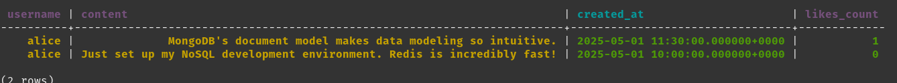

---

### 8.5 Step 4: Creating the Followers Table

```cql
CREATE TABLE IF NOT EXISTS followers (
  user_id UUID,
  follower_id UUID,
  follower_username TEXT,
  followed_at TIMESTAMP,
  PRIMARY KEY (user_id, follower_id)
);
```

I inserted follower relationships:

```cql
INSERT INTO followers (user_id, follower_id, follower_username, followed_at)
VALUES (11111111-1111-1111-1111-111111111111,
  22222222-2222-2222-2222-222222222222, 'bob', toTimestamp(now()));

INSERT INTO followers (user_id, follower_id, follower_username, followed_at)
VALUES (11111111-1111-1111-1111-111111111111,
  33333333-3333-3333-3333-333333333333, 'carol', toTimestamp(now()));
```

I retrieved Alice's followers:

```cql
SELECT follower_username, followed_at
FROM followers
WHERE user_id = 11111111-1111-1111-1111-111111111111;
```

**Screenshot : SELECT from followers output:**

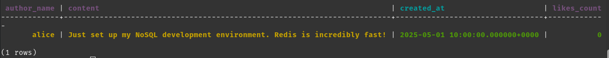

---

### 8.6 Step 5: Creating the Timeline Table (Fan-out on Write)

This table answers: "Show me the news feed for user X." Posts are duplicated into each follower's timeline at write time — the standard Cassandra fan-out-on-write pattern.

```cql
CREATE TABLE IF NOT EXISTS timeline_by_user (
  user_id UUID,
  created_at TIMESTAMP,
  post_id UUID,
  author_id UUID,
  author_name TEXT,
  content TEXT,
  likes_count INT,
  PRIMARY KEY (user_id, created_at, post_id)
) WITH CLUSTERING ORDER BY (created_at DESC, post_id ASC);
```

I inserted Alice's post into both Bob's and Carol's timelines:

```cql
INSERT INTO timeline_by_user
  (user_id, created_at, post_id, author_id, author_name, content, likes_count)
VALUES (22222222-2222-2222-2222-222222222222,
  '2025-05-01 10:00:00+0000', uuid(),
  11111111-1111-1111-1111-111111111111, 'alice',
  'Just set up my NoSQL development environment. Redis is incredibly fast!', 0);

INSERT INTO timeline_by_user
  (user_id, created_at, post_id, author_id, author_name, content, likes_count)
VALUES (33333333-3333-3333-3333-333333333333,
  '2025-05-01 10:00:00+0000', uuid(),
  11111111-1111-1111-1111-111111111111, 'alice',
  'Just set up my NoSQL development environment. Redis is incredibly fast!', 0);
```

I retrieved Bob's news feed:

```cql
SELECT author_name, content, created_at, likes_count
FROM timeline_by_user
WHERE user_id = 22222222-2222-2222-2222-222222222222
LIMIT 20;
```

**Screenshot : SELECT from timeline_by_user output (Bob's feed):**


---

### 8.7 Step 6: Query Tracing for Performance Analysis

I enabled Cassandra's built-in tracing to see per-step execution details:

```cql
TRACING ON;

SELECT author_name, content, created_at
FROM timeline_by_user
WHERE user_id = 22222222-2222-2222-2222-222222222222
LIMIT 10;

TRACING OFF;
```

**Screenshot : TRACING ON query output:**

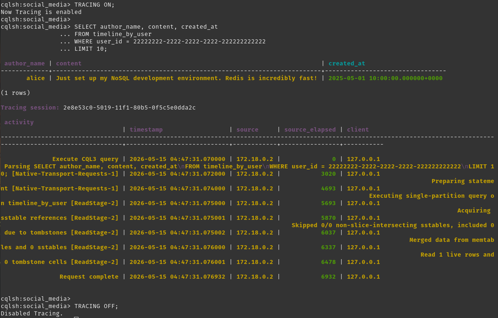

---

### 8.8 Step 7: Demonstrating Cassandra's Query Limitation

I attempted to query by a non-primary-key column to demonstrate Cassandra's fundamental constraint:

```cql
SELECT * FROM posts_by_user WHERE username = 'alice';
```

Expected error:
```
InvalidRequest: Cannot execute this query as it might involve data filtering and thus may have unpredictable performance. If you want to execute this query despite the performance unpredictability, use ALLOW FILTERING
```

**Screenshot : InvalidRequest error output:**

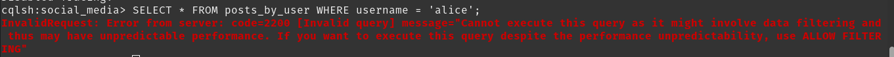

This error is expected and demonstrates the core Cassandra design philosophy: **the schema is the query plan**. Cassandra can only filter on partition keys and clustering columns. If querying by username is needed, a separate table indexed by username must be created.

---

### 8.9 Cassandra Observations

- Every table in Cassandra is purpose-built for one access pattern.
- The partition key determines which node stores the data; the clustering columns determine sort order within the partition.
- `ALLOW FILTERING` is strongly discouraged in production — it signals a missing table design.
- The fan-out-on-write pattern (writing a post to every follower's timeline) is the standard approach for news feeds at scale.
- Tracing reveals per-node execution details in microseconds, which is invaluable for performance tuning.

---
 
## 10. Exercises
 
### Exercise 1 — Redis: Trending Hashtags
 
For this exercise, I modelled a "Trending Hashtags" feature using a Redis Sorted Set. The score for each hashtag represents the number of posts using it. I used Bhutanese hashtags relevant to local culture and technology.
 
I connected to Redis:
```bash
docker exec -it redis_social redis-cli
```
 
I inserted five hashtags with their initial post counts as scores:
```redis
ZADD trending:hashtags 145 "drukair"
ZADD trending:hashtags 98 "thimphu"
ZADD trending:hashtags 76 "grossnationalhappiness"
ZADD trending:hashtags 54 "tashichodzong"
ZADD trending:hashtags 32 "bhutantech"
```
 
I retrieved the top 3 trending hashtags (highest score first):
```redis
ZREVRANGE trending:hashtags 0 2 WITHSCORES
```
 
Expected output:
```
1) "drukair"
2) "145"
3) "thimphu"
4) "98"
5) "grossnationalhappiness"
6) "76"
```
 
I then simulated new posts using hashtags to demonstrate atomic score updates:
```redis
ZINCRBY trending:hashtags 10 "thimphu"
ZINCRBY trending:hashtags 5 "bhutantech"
```
 
I retrieved the updated top 3:
```redis
ZREVRANGE trending:hashtags 0 2 WITHSCORES
```
 
**Screenshot : ZADD, ZREVRANGE and ZINCRBY output:**
 
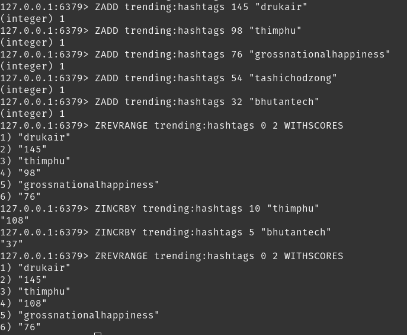
 
**Key Insight:** The Sorted Set data structure is ideal for leaderboard-style features. `ZINCRBY` is atomic, meaning concurrent post submissions from thousands of users will never produce incorrect counts; a critical property for a high-traffic trending feature.
 
---
 
### Exercise 2 — MongoDB: Top 5 Most-Liked Posts with $lookup
 
For this exercise, I wrote an aggregation pipeline that returns the top five most-liked posts across all users, joining author information from the `users` collection using the `$lookup` stage.
 
I first inserted Bhutanese-context users and posts:
 
```javascript
use social_media_db
 
db.users.insertMany([
  {
    _id: "user_2001",
    username: "tenzin_w",
    name: "Tenzin Wangchuk",
    bio: "Software developer from Thimphu.",
    joined: new Date("2024-01-10"),
    following: ["user_2002", "user_2003"]
  },
  {
    _id: "user_2002",
    username: "sonam_d",
    name: "Sonam Dorji",
    bio: "Database enthusiast from Paro.",
    joined: new Date("2024-02-14"),
    following: ["user_2003"]
  },
  {
    _id: "user_2003",
    username: "karma_c",
    name: "Karma Choden",
    bio: "UI designer from Phuntsholing.",
    joined: new Date("2024-03-05"),
    following: []
  }
])
 
db.posts.insertMany([
  {
    _id: "post_b001",
    user_id: "user_2001",
    username: "tenzin_w",
    content: "Just visited Tashichodzong — the architecture is breathtaking!",
    created_at: new Date("2025-05-01T08:00:00Z"),
    likes: ["user_2002", "user_2003"],
    comments: [],
    tags: ["tashichodzong", "thimphu", "bhutan"]
  },
  {
    _id: "post_b002",
    user_id: "user_2002",
    username: "sonam_d",
    content: "Exploring NoSQL databases for the Bhutan e-Government project.",
    created_at: new Date("2025-05-01T09:30:00Z"),
    likes: ["user_2001", "user_2003"],
    comments: [],
    tags: ["nosql", "bhutantech", "egovernment"]
  },
  {
    _id: "post_b003",
    user_id: "user_2003",
    username: "karma_c",
    content: "Designed a new dashboard for the Druk Gyalpo's relief fund portal.",
    created_at: new Date("2025-05-01T11:00:00Z"),
    likes: ["user_2001"],
    comments: [],
    tags: ["design", "bhutan", "ui"]
  },
  {
    _id: "post_b004",
    user_id: "user_2001",
    username: "tenzin_w",
    content: "Redis sorted sets are perfect for building trending hashtags in Dzongkha social apps.",
    created_at: new Date("2025-05-01T13:00:00Z"),
    likes: ["user_2002", "user_2003"],
    comments: [],
    tags: ["redis", "bhutantech", "nosql"]
  },
  {
    _id: "post_b005",
    user_id: "user_2002",
    username: "sonam_d",
    content: "Attending the National Day celebration in Thimphu — GNH in action!",
    created_at: new Date("2025-05-01T15:00:00Z"),
    likes: [],
    comments: [],
    tags: ["nationalday", "gnh", "thimphu"]
  }
])
```
 
I then ran the aggregation pipeline:
 
```javascript
db.posts.aggregate([
  // Step 1: Compute like count from the likes array
  {
    $addFields: {
      likes_count: { $size: { $ifNull: ["$likes", []] } }
    }
  },
  // Step 2: Sort by likes descending
  { $sort: { likes_count: -1 } },
  // Step 3: Take top 5 only
  { $limit: 5 },
  // Step 4: Join with users collection to get author details
  {
    $lookup: {
      from: "users",
      localField: "user_id",
      foreignField: "_id",
      as: "author_info"
    }
  },
  // Step 5: Flatten the joined array into a single object
  { $unwind: "$author_info" },
  // Step 6: Return only the required fields
  {
    $project: {
      _id: 0,
      content: 1,
      likes_count: 1,
      username: "$author_info.username",
      author_name: "$author_info.name"
    }
  }
])
```
 
**Screenshot : aggregation pipeline output:**
 
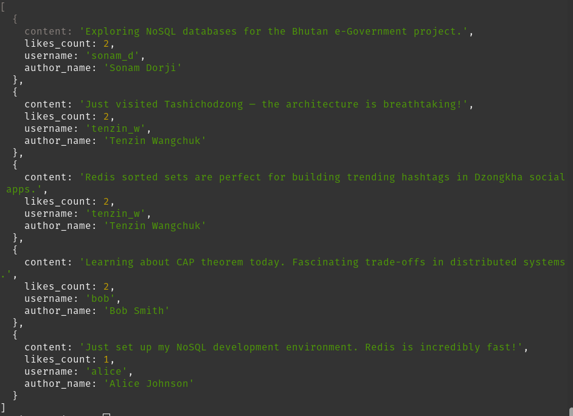
 
**Key Insight:** The `$lookup` stage performs a left outer join between the `posts` and `users` collections entirely on the server side. This avoids multiple round trips from the application. The pipeline approach — match, sort, limit, join, project — mirrors SQL's SELECT with JOIN, ORDER BY, and LIMIT but operates on documents rather than rows.
 
---
 
### Exercise 3 — Cassandra: posts_by_tag Table
 
For this exercise, I created a new table `posts_by_tag` designed specifically to answer the query: "Retrieve all posts with a given tag, sorted by creation time, most recent first."
 
I connected to Cassandra:
```bash
docker exec -it cassandra_social cqlsh
USE social_media;
```
 
I created the table with `tag` as the partition key and `created_at` as the clustering column in descending order:
 
```cql
CREATE TABLE IF NOT EXISTS posts_by_tag (
  tag TEXT,
  created_at TIMESTAMP,
  post_id UUID,
  user_id UUID,
  username TEXT,
  content TEXT,
  PRIMARY KEY (tag, created_at, post_id)
) WITH CLUSTERING ORDER BY (created_at DESC, post_id ASC);
```
 
I inserted five posts with overlapping Bhutanese-context tags:
 
```cql
INSERT INTO posts_by_tag (tag, created_at, post_id, user_id, username, content)
VALUES ('bhutantech', '2025-05-01 08:00:00+0000', uuid(),
  11111111-1111-1111-1111-111111111111, 'tenzin_w',
  'Redis sorted sets are perfect for Dzongkha social apps.');
 
INSERT INTO posts_by_tag (tag, created_at, post_id, user_id, username, content)
VALUES ('bhutantech', '2025-05-01 09:30:00+0000', uuid(),
  22222222-2222-2222-2222-222222222222, 'sonam_d',
  'Exploring NoSQL for the Bhutan e-Government project.');
 
INSERT INTO posts_by_tag (tag, created_at, post_id, user_id, username, content)
VALUES ('bhutantech', '2025-05-01 11:00:00+0000', uuid(),
  33333333-3333-3333-3333-333333333333, 'karma_c',
  'Designed a dashboard for the Druk Gyalpo relief fund portal.');
 
INSERT INTO posts_by_tag (tag, created_at, post_id, user_id, username, content)
VALUES ('thimphu', '2025-05-01 08:00:00+0000', uuid(),
  11111111-1111-1111-1111-111111111111, 'tenzin_w',
  'Just visited Tashichodzong — the architecture is breathtaking!');
 
INSERT INTO posts_by_tag (tag, created_at, post_id, user_id, username, content)
VALUES ('thimphu', '2025-05-01 15:00:00+0000', uuid(),
  22222222-2222-2222-2222-222222222222, 'sonam_d',
  'Attending the National Day celebration in Thimphu — GNH in action!');
```
 
I retrieved all posts tagged "bhutantech", most recent first:
 
```cql
SELECT username, content, created_at
FROM posts_by_tag
WHERE tag = 'bhutantech';
```

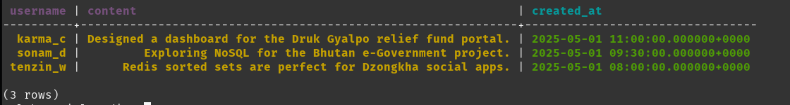
 
I also queried all posts tagged "thimphu":
 
```cql
SELECT username, content, created_at
FROM posts_by_tag
WHERE tag = 'thimphu';
```
 
**Screenshot : posts_by_tag SELECT output for both tags:**

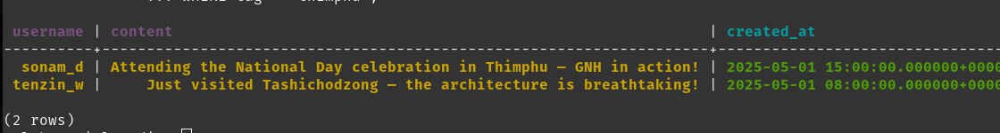
 
**Key Insight:** Note that the same post content appears in multiple rows under different tags — this is intentional denormalization. In Cassandra, if a post has three tags, it must be inserted into `posts_by_tag` three times (once per tag). This is the fan-out-on-write pattern applied to tags. The benefit is that tag-based retrieval is a single, fast partition read with no filtering needed.
 
---
 
### Exercise 4 — Comparison: Handling a Username Change
 
**Scenario:** Tenzin Wangchuk decides to change his username from `tenzin_w` to `tenzin_wangchuk`.
 
| Aspect | Redis | MongoDB | Cassandra |
|---|---|---|---|
| **Where username is stored** | Only in `user:1001` Hash as one field | In `users` collection + denormalized inside every post document as `username` field | In `users` table + denormalized in `posts_by_user`, `timeline_by_user`, `posts_by_tag`, and `followers` tables |
| **Update command required** | `HSET user:1001 username "tenzin_wangchuk"` — one operation | `db.users.updateOne(...)` + `db.posts.updateMany({ user_id: "user_2001" }, { $set: { username: "tenzin_wangchuk" } })` | `UPDATE users SET username = 'tenzin_wangchuk' WHERE user_id = ...` + separate UPDATE statements on every affected row in every table |
| **Number of writes** | 1 | 1 + number of Tenzin's posts | 1 + Tenzin's posts + all follower timelines + all tag entries |
| **Consistency risk** | Very Low — username exists in exactly one place | Medium — posts may briefly show old username during the bulk update window | High — denormalized copies across many tables may be inconsistent during update |
| **Difficulty** | Trivial | Moderate — `updateMany` handles it in one command | Complex — CQL has no cross-table bulk update; application must manage each table individually |
 
**What this reveals about each data model:**
 
**Redis** stores the username only in the user Hash and uses numeric user IDs as references everywhere else. A username change requires a single `HSET` command. This is the benefit of indirection — no duplication means no fan-out on updates. The cost is that fetching a post's author name requires a separate lookup by user ID.
 
**MongoDB** encourages embedding for read performance, which means Tenzin's username is duplicated inside every post document he authored. A `updateMany` with `$set` handles this in one command, but it is not atomic across documents. A server crash mid-update would leave some posts showing `tenzin_w` and others showing `tenzin_wangchuk` until the operation completes or is retried.
 
**Cassandra** pays the steepest cost for a username change. Tenzin's username is stored in `posts_by_user`, `timeline_by_user`, `posts_by_tag`, and `followers` — each table purpose-built for a different query pattern. CQL has no equivalent of `updateMany` across tables. The application must issue individual `UPDATE` statements for every affected row in every table, and Cassandra offers no cross-table transactions to guarantee consistency. For a user like Tenzin who has thousands of posts and millions of followers, this could mean millions of individual write operations.
 
**The broader lesson** this exercise reveals is the fundamental tension between **normalization** and **denormalization**:
 
- **Normalization** (Redis approach): store data once, update once, but reads require multiple lookups.
- **Denormalization** (Cassandra approach): store data in many places for fast reads, but updates are expensive and risk inconsistency.
- **MongoDB** sits in the middle, giving the developer a choice and providing tools (`updateMany`) to manage the trade-off.
In real-world social media platforms, this is why usernames are often treated as immutable after creation, or username changes are rate-limited — not because of technical difficulty, but because of the cascading write cost in denormalized systems.
 


## 11. Summary and Conclusion

In this practical, I set up and worked with three fundamentally different NoSQL databases ; Redis, MongoDB, and Cassandra where each  was implemented on the same social media data model. The experience revealed how differently each database approaches the same conceptual requirements.

**Redis** excels at speed above all else. Its in-memory architecture makes it ideal for caching, session management, and real-time counters. However, the lack of schema enforcement and the need for multiple round trips to reconstruct complex objects makes it unsuitable as a primary data store for a full social media platform.

**MongoDB** offered the most developer-friendly experience for this use case. Its document model naturally accommodates the nested structure of social media data (posts with embedded comments and likes), and the aggregation framework enabled complex feed queries in a single server-side operation. The flexible schema is both its greatest strength and its greatest risk without proper validation.

**Cassandra** demanded the most upfront design thinking. Every table had to be designed around a specific query pattern rather than around entities. The fan-out-on-write pattern for timelines — writing a post to every follower's feed at write time — demonstrated how Cassandra trades write amplification for extremely fast reads. The `InvalidRequest` error when querying a non-partition-key column was a clear demonstration of this philosophy in practice.

**If I were to select a database for a real social media platform**, I would use a combination: **Redis** for caching and session tokens, **MongoDB** for user profiles and content management where ad-hoc queries are needed, and **Cassandra** for high-volume feed and timeline storage at scale. This hybrid approach reflects real-world architectures used by platforms like Twitter and Instagram.

---

## 12. References

- Redis Documentation: https://redis.io/docs/
- MongoDB Documentation: https://www.mongodb.com/docs/
- Apache Cassandra Documentation: https://cassandra.apache.org/doc/
- CAP Theorem — Brewer, E. (2000). Towards Robust Distributed Systems.
- DBS302 Practical 1 Lab Sheet — Setting Up Redis, MongoDB, and Cassandra